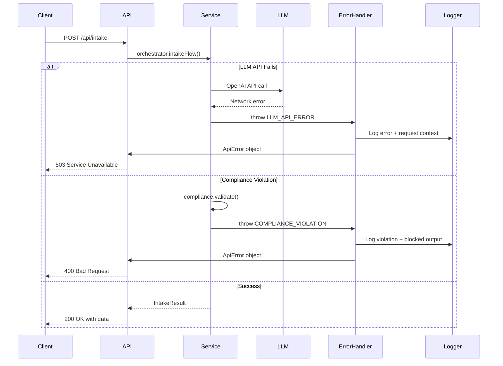

# 18. Error Handling Strategy

**Purpose:** Centralized error handling ensuring consistent user experience, comprehensive logging, and compliance audit trail.

## 18.1 Error Flow Architecture



**Why This Flow:**
- **Centralized error handler:** Single place for error transformation and logging (DRY principle)
- **Service throws errors:** Business logic doesn't handle HTTP concerns (clean separation)
- **Structured error codes:** Frontend maps codes to user-friendly messages (predictable handling)
- **Compliance violations logged:** All blocked outputs written to compliance log for regulatory review

## 18.2 Error Response Format (Non-Standard)

**What We Use:**
```typescript
// packages/shared/src/types/errors.ts
interface ApiError {
  error: {
    code: ErrorCode          // Machine-readable error code (see 18.3)
    message: string          // Technical error message (for developers)
    details?: object         // Optional context (violations, missing fields, etc.)
    timestamp: string        // ISO 8601 timestamp
    requestId: string        // Request correlation ID for debugging
  }
}
```

**Why This Format:**
- **Consistent structure:** All errors follow same shape (predictable frontend parsing)
- **Machine-readable codes:** Frontend maps codes to user-friendly messages
- **Details for debugging:** Violations array, missing fields, stack traces (dev only)
- **Request IDs:** Correlate frontend errors with backend logs

## 18.3 Shared Error Codes (packages/shared/src/types/errors.ts)

**Error Code Contract (Frontend + Backend):**

| Code | HTTP Status | When Used | User-Facing Message | Details Field |
|------|-------------|-----------|---------------------|---------------|
| `COMPLIANCE_VIOLATION` | 400 | Compliance filter blocks output | "Your request contains language that violates insurance regulations. Please rephrase." | `{ violations: string[] }` |
| `EXTRACTION_FAILED` | 400 | LLM cannot extract UserProfile fields | "We couldn't understand your request. Please provide more details." | `{ missingFields?: string[] }` |
| `ROUTING_FAILED` | 400 | No carriers available for user profile | "No insurance carriers are available for your profile." | `{ reason: string }` |
| `DISCOUNT_ENGINE_ERROR` | 500 | Discount calculation fails unexpectedly | "Unable to calculate discounts. Please try again." | `{ carrier: string }` |
| `LLM_API_ERROR` | 503 | OpenAI API timeout or network error | "Our AI service is temporarily unavailable. Please try again." | `{ provider: 'openai' }` |
| `VALIDATION_ERROR` | 400 | Zod validation fails on API request | "Invalid request format. Please check your input." | `{ errors: ZodError[] }` |
| `KNOWLEDGE_PACK_ERROR` | 500 | RAG query fails (file not found, parse error) | "System configuration error. Please contact support." | `{ file: string }` |
| `INTERNAL_ERROR` | 500 | Unexpected errors (catch-all) | "An unexpected error occurred. Please try again." | `{}` |

**Why These Codes:**
- **COMPLIANCE_VIOLATION:** Insurance regulatory requirement - must block non-compliant outputs
- **EXTRACTION_FAILED:** User feedback - LLM couldn't parse message (ask for more info)
- **ROUTING_FAILED:** Business logic - no carriers match user profile (legitimate rejection)
- **LLM_API_ERROR:** Service dependency - OpenAI down/timeout (retry makes sense)
- **VALIDATION_ERROR:** Input validation - Zod caught malformed request (dev error or malicious input)
- **KNOWLEDGE_PACK_ERROR:** Data integrity - missing/corrupt knowledge pack files (deployment issue)
- **INTERNAL_ERROR:** Catch-all for unexpected errors (unknown bugs)

## 18.4 Frontend Error Handling

**What We Use:**
- TanStack Query `onError` callbacks for API errors
- shadcn/ui Toast component for user-friendly error display
- Error code → message mapping (imports from `@repo/shared`)

**Why This Approach:**
- **TanStack Query handles errors automatically:** No manual try/catch in every component
- **Toast notifications:** Non-blocking, user-friendly error display
- **Shared error codes:** Frontend imports `ErrorCode` type from `@repo/shared` (single source of truth)

## 18.5 Backend Error Handling

**What We Use:**
- Global error handler middleware (catches all errors)
- Custom `AppError` class with code, message, statusCode, details
- Hono's HTTP exception integration

**Why This Approach:**
- **Global middleware:** Catches all errors, no try/catch in route handlers
- **AppError class:** Structured errors with consistent format, imports `ErrorCode` type
- **Logging context:** Every error logged with request path, method, stack trace

---
