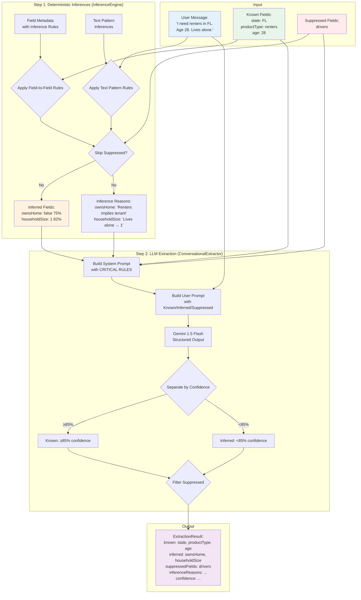

# 6. Components

This section describes the 5 core components (2 LLM Agents + 3 Deterministic Engines) and 2 supporting components (RAG + Orchestrator) that fulfill PEAK6's "multi-agent preferred" requirement.

---

## 6.1 Conversational Extractor Agent (Hybrid LLM + Inference)

**Purpose:** Extract structured insurance shopper data from natural language input or policy documents using a hybrid approach: deterministic inference rules + LLM extraction.

**Key Responsibilities:**

- Parse free-form broker messages into structured UserProfile fields
- Extract existing policy details from uploaded policy text
- Apply deterministic field-to-field inferences (e.g., `productType="renters"` → `ownsHome=false`)
- Apply text pattern inferences (e.g., "Lives alone" → `householdSize=1`)
- Separate **known fields** (broker-curated, read-only) from **inferred fields** (system-derived, editable)
- Respect suppression list (fields broker has explicitly dismissed)
- Identify missing required fields for quote completion
- Support progressive disclosure (extract what's mentioned, flag what's missing)

**Dependencies:**

- Google Gemini API (Gemini 1.5 Flash for cost efficiency and structured outputs)
- InferenceEngine (deterministic rule application from `@repo/shared`)
- Zod schemas for structured output validation
- Field metadata with inference rules (`packages/shared/src/schemas/unified-field-metadata.ts`)
- Text pattern inferences (`packages/shared/src/config/text-pattern-inferences.ts`)

**Hybrid Architecture (Inference + LLM):**

**Step 1: Deterministic Inferences** (InferenceEngine)
- Apply field-to-field rules (e.g., `productType="renters"` → `ownsHome=false`, confidence: 75%)
- Apply text pattern rules (e.g., "Lives alone" → `householdSize=1`, confidence: 82%)
- Skip suppressed fields (broker has dismissed these inferences)
- Generate inference reasons and confidence scores

**Step 2: LLM Extraction** (ConversationalExtractor)
- Receive known fields (broker-curated), inferred fields (from Step 1), and suppressed fields
- Apply **5 Critical Rules for Field Extraction:**
  1. **KNOWN FIELDS (read-only):** Never modify broker-set fields
  2. **INFERRED FIELDS (can modify):** Confirm, edit, delete, or upgrade based on text evidence
  3. **SUPPRESSED FIELDS (never infer):** Respect user dismissals
  4. **CONFIDENCE LEVELS:** High (≥85%), Medium (70-84%), Low (<70%). Upgrade to known if ≥85%
  5. **EXTRACTION PRIORITY:** Fill missing fields, improve inferred fields with better evidence
- Separate fields into known (≥85% confidence) vs inferred (<85% confidence)
- Return structured ExtractionResult with known/inferred separation

**Method Signature:**

```typescript
async extractFields(
  message: string,
  knownFields?: Partial<UserProfile>,
  inferredFields?: Partial<UserProfile>,
  suppressedFields?: string[]
): Promise<ExtractionResult>
```

**Response Schema:**

```typescript
{
  extraction: {
    method: 'hybrid',
    known: Partial<UserProfile>,           // Broker-curated + high-confidence (≥85%)
    inferred: Partial<UserProfile>,        // Low-medium confidence (<85%)
    suppressedFields: string[],            // Dismissed fields
    inferenceReasons: Record<string, string>, // Why each field was inferred
    confidence: Record<string, number>     // Confidence scores (0-1)
  }
}
```

**Design Decisions:**

- **Hybrid approach:** Deterministic inferences run first (faster, cheaper), then LLM fills gaps and improves results
- **Known vs inferred separation:** Enables transparent field curation by brokers with visual distinction in UI
- **Suppression list:** Respects broker's explicit rejections, prevents re-inferring dismissed fields
- **LLM for flexibility:** Natural language parsing requires LLM, not regex/rules alone
- **Structured outputs:** JSON mode with Zod schema enforcement ensures type safety
- **Missing fields tracking:** Enables progressive disclosure UX (collect more info as needed)
- **Gemini 1.5 Flash selected:** Cost-efficient with native structured outputs, sufficient for extraction task
- **Confidence thresholds:** ≥85% promotes inferred → known, balancing accuracy with broker control

**Inference Architecture Diagram:**



**Diagram Explanation:**

1. **Input:** User message + known fields (broker-curated) + suppressed fields (dismissed)
2. **Step 1 (InferenceEngine):** Deterministic rules apply field-to-field and text pattern inferences, skipping suppressed fields
3. **Step 2 (ConversationalExtractor):** LLM receives all context, applies CRITICAL RULES, separates known (≥85%) vs inferred (<85%)
4. **Output:** Structured ExtractionResult with separated known/inferred fields, reasons, and confidence scores

**File Locations:**

- **ConversationalExtractor:** `apps/api/src/services/conversational-extractor.ts`
- **InferenceEngine:** `packages/shared/src/services/inference-engine.ts`
- **Field Metadata:** `packages/shared/src/schemas/unified-field-metadata.ts`
- **Text Patterns:** `packages/shared/src/config/text-pattern-inferences.ts`
- **LLM Prompts:** `apps/api/src/prompts/conversational-extraction-*.txt`

---

## 6.2 Pitch Generator Agent (LLM)

**Purpose:** Transform structured opportunity data into human-friendly savings recommendations with "because" rationales.

**Key Responsibilities:**

- Generate agent-ready talking points from discount opportunities
- Include "because" explanations for each recommendation (spec requirement)
- Format pitch as markdown for broker presentation
- Maintain citations from knowledge pack in narrative

**Dependencies:**

- Google Gemini API (Gemini 1.5 Flash for quality and cost-efficiency)
- Opportunity data with citations
- UserProfile for personalization context

**Design Decisions:**

- **LLM for narrative generation:** Broker-ready prose requires natural language generation
- **Gemini 1.5 Flash selected:** Unified model for both extraction and pitch generation (simpler integration, cost-efficient)
- **Structured input → prose output:** Deterministic data fed to LLM for consistent style
- **Citation preservation:** Pitch references opportunity citations for compliance traceability

---

## 6.3 Routing Engine (Deterministic)

**Purpose:** Determine eligible insurance carriers based on state, product, and user profile using knowledge pack rules.

**Key Responsibilities:**

- Filter carriers by state availability (operates_in check)
- Filter by product offering (auto, home, renters, umbrella)
- Apply eligibility criteria (age limits, vehicle limits, etc.)
- Return sorted list with primary recommendation + alternatives

**Dependencies:**

- Knowledge Pack RAG for carrier data

**Design Decisions:**

- **100% deterministic:** No LLM variability for compliance-critical routing decisions
- **Pure functions:** Testable, auditable logic with predictable outputs
- **Why deterministic matters:** Insurance regulators require explainable routing (no black-box AI)
- **Citation tracking:** Every routing decision references knowledge pack file + cuid2 ID for audit trail

---

## 6.4 Discount Engine (Deterministic)

**Purpose:** Identify applicable discounts and calculate dollar savings based on user profile and carrier discount rules.

**Key Responsibilities:**

- Check discount eligibility (safe driver, multi-policy, paperless, etc.)
- Calculate annual savings in dollars (not just percentages)
- Generate opportunity objects with citations to knowledge pack
- Handle bundle discounts across product lines
- Analyze multi-carrier consolidation opportunities (requires `existingPolicies` data)

**Dependencies:**

- Knowledge Pack RAG for discount rules
- UserProfile with `existingPolicies` array for bundle analysis

**Design Decisions:**

- **100% deterministic:** Discount eligibility must be auditable and explainable
- **Dollar savings calculated:** More meaningful to brokers than percentages alone
- **Mandatory citations:** Every opportunity references knowledge pack source for compliance
- **Why deterministic matters:** Financial calculations cannot have LLM hallucination risk
- **Multi-carrier tracking:** Bundle discount analysis requires knowing which carriers user currently has for each product (stored in `existingPolicies` field)

---

## 6.5 Compliance Filter (Deterministic)

**Purpose:** Ensure 100% regulatory compliance by blocking prohibited statements and injecting required disclaimers.

**Key Responsibilities:**

- Validate all user-facing outputs against prohibited phrase list
- Block outputs entirely if violations detected (no partial pass-through)
- Inject required insurance disclaimers into all pitches
- Log violations to compliance log for review

**Dependencies:** None (hard-coded compliance rules)

**Design Decisions:**

- **100% deterministic:** No LLM involvement in compliance decisions
- **Hard-coded rules:** Prohibited phrases and disclaimers are static, not learned
- **Block, don't sanitize:** If violations detected, entire output rejected (safer than auto-correction)
- **Why hard-coded:** Insurance compliance rules are legal requirements, not AI-generated
- **Audit trail:** All blocked outputs logged with violation details for regulatory review

**Critical Compliance Rules (Non-Standard Implementation):**

**Prohibited Phrases** (case-insensitive):

- "guaranteed lowest rate"
- "we'll definitely save you"
- "best price guaranteed"
- "you will save"
- "guaranteed approval"

**Required Disclaimers** (appended to all pitches):

- "Rates subject to underwriting and approval"
- "Actual rates may vary based on complete application"
- "Must be reviewed and finalized by a licensed insurance agent"
- "Not a binding quote"

---

## 6.6 Knowledge Pack RAG (Structured Query)

**Purpose:** Provide fast, citation-tracked access to offline insurance knowledge loaded at startup.

**Key Responsibilities:**

- Load carrier/state JSON files at startup (async, non-blocking) into memory Maps
- Track cuid2 IDs for citation generation
- Provide exact key-based queries (carrier + state + product)
- Return results with file path + cuid2 ID for every data point

**Dependencies:**

- Filesystem access to `knowledge_pack/` directory

**Design Decisions:**

- **Startup loading (async, non-blocking):** Knowledge pack loaded during initialization ensures data is immediately available for all queries, while async loading prevents blocking container startup
- **Structured queries, not semantic search:** Known keys (carrier, state, product) make exact queries faster and more accurate than vector embeddings
- **Citation tracking (non-standard):** cuid2-based IDs attached to every entity, enabling audit trail without line number fragility (see `docs/knowledge-pack/id-conventions.md`)
- **In-memory Maps:** O(1) lookup after initial load, fast enough for demo scale
- **Why no vector store:** Knowledge pack has structured keys, not free-form text requiring semantic search

**Citation Format Example (Non-Standard):**

```typescript
{
  citations: [
    {
      id: 'disc_ckm9x7wdx1', // cuid2 ID from knowledge pack
      type: 'discount', // Entity type (discount, carrier, eligibility, etc.)
      carrier: 'carr_ckm9x7w8k0', // Parent carrier cuid2 ID
      file: 'knowledge_pack/carriers/geico.json', // Source file path
    },
  ]
}
```

---

## 6.7 Orchestrator

**Purpose:** Coordinate agent/engine execution for conversational intake and policy analysis workflows.

**Key Responsibilities:**

- Execute 5-step conversational flow: Extract → Route → Discounts → Pitch → Compliance
- Execute 5-step policy analysis flow: Parse → Route → Discounts (includes bundle analysis) → Pitch → Compliance
- Generate decision trace for every interaction (audit logging)
- Handle errors and transform to structured API responses
- Log LLM token usage for cost tracking

**Dependencies:** All agents and engines

**Design Decisions:**

- **Sequential execution:** Each step depends on previous results, no parallelization needed
- **Decision trace generation:** Every flow produces complete audit trail for compliance log
- **Error transformation:** Service-layer errors converted to user-friendly API errors
- **Why orchestrator pattern:** Centralized control flow enables consistent logging, error handling, and trace generation across both workflows

---
