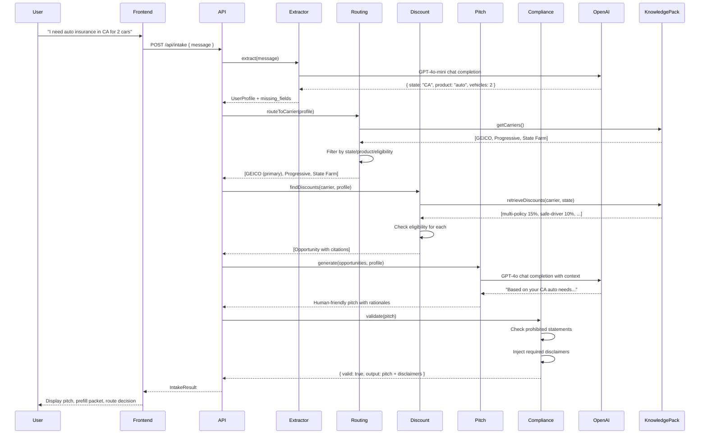
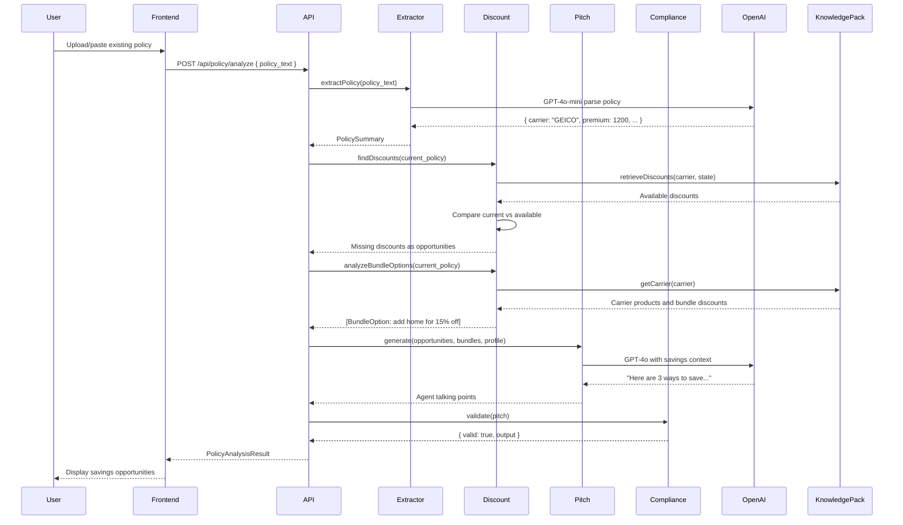
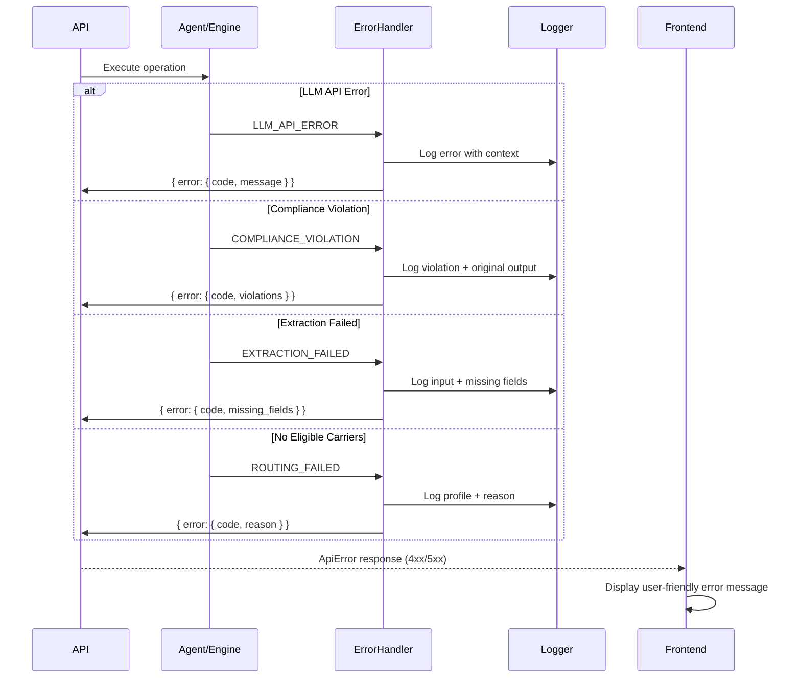

# 8. Core Workflows

This section illustrates the two primary workflows that fulfill PEAK6's spec requirements: conversational intake and policy-based savings analysis.

**Why These Workflows:**
- **Conversational intake:** Enables brokers to start with natural language (no forms), system extracts structured data
- **Policy analysis:** Enables brokers to identify savings from existing policies (competitive advantage use case)
- **Sequential execution:** Each step depends on previous results, ensuring data flows correctly through hybrid LLM + rules architecture

---

## 8.1 Conversational Intake Flow

**What This Flow Accomplishes:**
- Broker provides free-form text → System returns complete quote recommendation with carrier routing, discount opportunities, and prefill packet

**Key Architectural Decisions:**
- **5-step sequential pipeline:** Extract → Route → Discounts → Pitch → Compliance (cannot parallelize due to data dependencies)
- **LLM for extraction and pitch only:** Deterministic engines handle routing/discounts/compliance (insurance regulatory requirement)
- **Compliance filter runs last:** Ensures 100% of outputs are regulation-compliant before reaching broker
- **Missing fields tracked:** Enables progressive disclosure UI (system asks for more info as needed)

**Why This Sequence:**
1. **Extraction first:** Must understand what user wants before routing
2. **Routing before discounts:** Need to know which carrier to query for discount rules
3. **Discounts before pitch:** Pitch Generator needs structured opportunity data to write compelling prose
4. **Compliance last:** Final safeguard ensures nothing non-compliant reaches broker

---

## 8.2 Policy Analysis Flow

**What This Flow Accomplishes:**
- Broker uploads existing policy → System identifies missing discounts, bundle opportunities, and deductible optimizations

**Key Architectural Decisions:**
- **5-step sequential pipeline:** Parse → Route → Discounts (includes bundle analysis) → Pitch → Compliance
- **Bundle analysis workflow:** Two invocations of the same Discount Engine component (Section 6.4):
  - **First call:** `findDiscounts()` identifies missing discounts on current policy
  - **Second call:** `analyzeBundleOptions()` identifies additional products for bundle discounts
  - Both functions are methods of the same Discount Engine, not separate components
- **Reuses routing/discount engines:** Same deterministic logic as conversational intake (code reuse)
- **Three opportunity types:** Missing discounts, bundle options, deductible trade-offs (comprehensive savings analysis per spec)
- **No new carrier routing:** Analyzes current carrier only (scope limitation for 5-day timeline)

**Why This Sequence:**
1. **Parse policy first:** Extract current carrier, premium, coverage details
2. **Missing discounts:** Compare what user has vs what they qualify for
3. **Bundle analysis:** Identify additional products (home, umbrella) that qualify for multi-policy discount
4. **Pitch generation:** Synthesize all opportunities into agent-ready talking points
5. **Compliance last:** Ensures savings claims don't violate insurance advertising regulations

**Key Difference from Intake Flow:**
- No routing engine (analyzes existing carrier only)
- Bundle analysis step added (home + auto = 15% discount)
- Pitch format optimized for "here's how to save" vs "here's a new quote"

**Bundle Discount Analysis (Non-Standard Implementation):**
- **Requires multi-carrier data:** Bundle opportunities depend on `existingPolicies` field in UserProfile tracking which carriers the user currently has for each product
- **Example:** User has auto with GEICO ($1200) + home with State Farm ($800) → Discount Engine identifies consolidation opportunity: move both to GEICO for 15% multi-policy discount = $300/year savings
- **Why this matters:** Many users have fragmented coverage across carriers and don't realize consolidation savings potential

---

## 8.3 Error Handling Flow

**What This Flow Accomplishes:**
- Any error in agents/engines → Structured error response → User-friendly message displayed

**Key Architectural Decisions:**
- **Centralized error handler:** Single place for error transformation and logging (DRY principle)
- **Structured error codes:** Machine-readable codes enable client-side error handling logic
- **Compliance violations logged separately:** All blocked outputs written to compliance log for regulatory review
- **No partial failures:** If any step fails, entire flow fails gracefully (no inconsistent state)

**Why Centralized Error Handling:**
- **Consistent error format:** All errors follow same structure (predictable client handling)
- **Comprehensive logging:** Every error logged with full context for debugging
- **User-friendly messages:** Error codes mapped to human-readable messages on frontend
- **Audit trail:** Compliance violations logged separately for regulatory review

---
