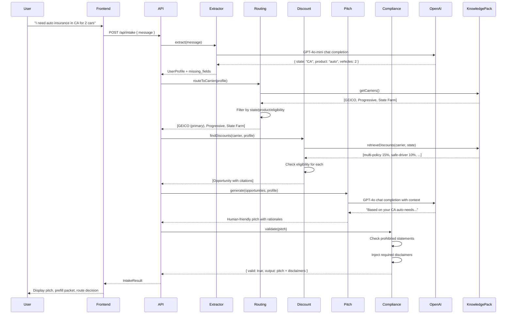
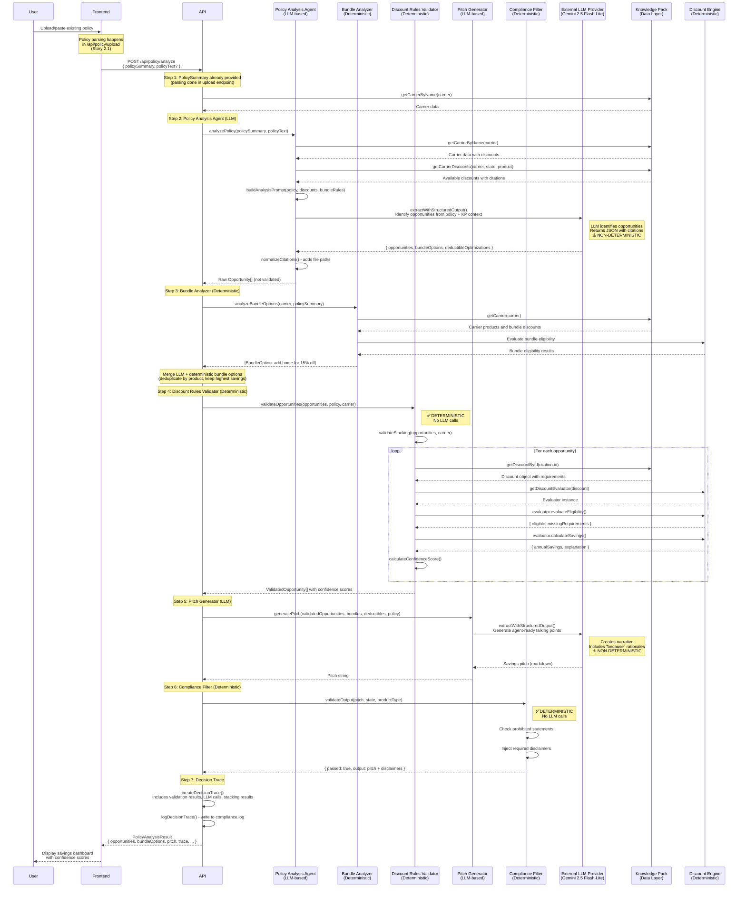
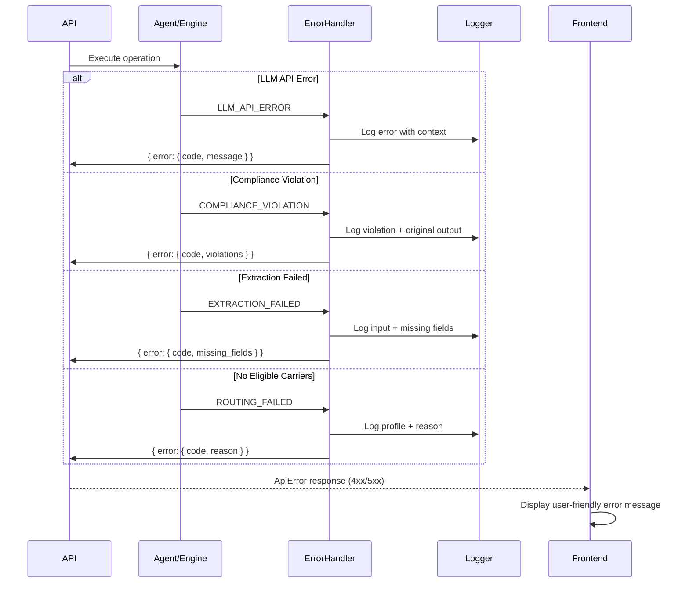

# 8. Core Workflows

This section illustrates the two primary workflows that fulfill PEAK6's spec requirements: conversational intake and policy-based savings analysis.

**Why These Workflows:**

- **Conversational intake:** Enables brokers to start with natural language (no forms), system extracts structured data
- **Policy analysis:** Enables brokers to identify savings from existing policies (competitive advantage use case)
- **Sequential execution:** Each step depends on previous results, ensuring data flows correctly through hybrid LLM + rules architecture

---

## 8.1 Conversational Intake Flow

**What This Flow Accomplishes:**

- Broker provides free-form text → System returns complete quote recommendation with carrier routing, discount opportunities, and prefill packet

**Key Architectural Decisions:**

- **5-step sequential pipeline:** Extract → Route → Discounts → Pitch → Compliance (cannot parallelize due to data dependencies)
- **LLM for extraction and pitch only:** Deterministic engines handle routing/discounts/compliance (insurance regulatory requirement)
- **Compliance filter runs last:** Ensures 100% of outputs are regulation-compliant before reaching broker
- **Missing fields tracked:** Enables progressive disclosure UI (system asks for more info as needed)

**Why This Sequence:**

1. **Extraction first:** Must understand what user wants before routing
2. **Routing before discounts:** Need to know which carrier to query for discount rules
3. **Discounts before pitch:** Pitch Generator needs structured opportunity data to write compelling prose
4. **Compliance last:** Final safeguard ensures nothing non-compliant reaches broker

---

## 8.2 Policy Analysis Flow

**What This Flow Accomplishes:**

- Broker uploads existing policy → System identifies missing discounts, bundle opportunities, and deductible optimizations

**Key Architectural Decisions:**

- **7-step sequential pipeline:** PolicySummary (pre-parsed) → Policy Analysis Agent (LLM) → Bundle Analyzer (deterministic) → Discount Rules Validator → Pitch → Compliance → Decision Trace
- **Policy parsing separation:** Policy parsing happens in `/api/policy/upload` endpoint (Story 2.1), not in analyze flow. Analyze endpoint receives pre-parsed `PolicySummary` as source of truth.
- **LLM-based opportunity identification:** Policy Analysis Agent uses LLM (Gemini 2.5 Flash-Lite) to identify opportunities from policy data + knowledge pack context, not deterministic discount engine calls
- **Dual bundle analysis approach:** 
  - **LLM identification:** Policy Analysis Agent identifies bundle options via LLM analysis
  - **Deterministic validation:** Bundle Analyzer (`analyzeBundleOptions()`) runs separately using deterministic rules
  - **Merge and deduplicate:** Results from both sources are merged, keeping highest estimated savings per product
- **Validation layer (Story 2.3):** Discount Rules Validator validates LLM-identified opportunities before pitch generation:
  - Validates stacking rules (which discounts can combine)
  - Re-validates eligibility using Discount Engine evaluators
  - Validates savings calculations
  - Calculates confidence scores based on data completeness
  - Flags discounts requiring additional documentation
- **Three opportunity types:** Missing discounts, bundle options, deductible trade-offs (comprehensive savings analysis per spec)
- **No carrier routing:** Analyzes current carrier only (scope limitation for 5-day timeline)
- **Decision trace logging:** All analysis steps logged to `logs/compliance.log` for audit trail and debugging

**Why This Sequence:**

1. **PolicySummary pre-parsed:** Policy parsing happens in upload endpoint (Story 2.1), analyze endpoint receives structured data as source of truth
2. **LLM opportunity identification:** Policy Analysis Agent uses LLM to identify opportunities from policy context + knowledge pack, enabling nuanced analysis of policy details
3. **Dual bundle analysis:** Combines LLM insights with deterministic rules for comprehensive bundle opportunity detection
4. **Validation layer:** Discount Rules Validator ensures LLM-identified opportunities are valid, eligible, and properly calculated before pitch generation
5. **Pitch generation:** Synthesizes validated opportunities into agent-ready talking points with "because" rationales
6. **Compliance last:** Ensures savings claims don't violate insurance advertising regulations
7. **Decision trace:** Logs all analysis steps for audit trail and debugging

**Key Differences from Intake Flow:**

- **No routing engine:** Analyzes existing carrier only (no carrier selection needed)
- **LLM-based opportunity identification:** Uses Policy Analysis Agent instead of deterministic Discount Engine `findDiscounts()` call
- **Validation layer added:** Discount Rules Validator validates LLM-identified opportunities (Story 2.3)
- **Dual bundle analysis:** LLM + deterministic bundle analysis with merge/deduplication
- **Policy parsing separated:** Parsing happens in upload endpoint, not in analyze flow
- **Decision trace logging:** Comprehensive logging of all analysis steps
- **Pitch format:** Optimized for "here's how to save" vs "here's a new quote"

**Bundle Discount Analysis Implementation:**

- **Dual approach:** 
  - Policy Analysis Agent (LLM) identifies bundle opportunities from policy context
  - Bundle Analyzer (deterministic) identifies bundle opportunities using Discount Engine rules
  - Results merged and deduplicated by product, keeping highest estimated savings
- **Deterministic bundle analysis:** Uses `analyzeBundleOptions()` function from Discount Engine to check:
  - Carrier product availability in state
  - Bundle discount eligibility rules
  - Estimated savings calculations
- **Example:** User has auto with GEICO ($1200) → Both LLM and Bundle Analyzer identify home insurance bundle opportunity → System merges results, shows highest savings estimate
- **Why this matters:** Combines LLM's ability to infer context with deterministic rules' reliability for comprehensive bundle opportunity detection

---

## 8.3 Error Handling Flow

**What This Flow Accomplishes:**

- Any error in agents/engines → Structured error response → User-friendly message displayed

**Key Architectural Decisions:**

- **Centralized error handler:** Single place for error transformation and logging (DRY principle)
- **Structured error codes:** Machine-readable codes enable client-side error handling logic
- **Compliance violations logged separately:** All blocked outputs written to compliance log for regulatory review
- **No partial failures:** If any step fails, entire flow fails gracefully (no inconsistent state)

**Why Centralized Error Handling:**

- **Consistent error format:** All errors follow same structure (predictable client handling)
- **Comprehensive logging:** Every error logged with full context for debugging
- **User-friendly messages:** Error codes mapped to human-readable messages on frontend
- **Audit trail:** Compliance violations logged separately for regulatory review

---
