```mermaid
graph TD
    Start([Broker opens IQuote Pro]) --> Home[Home: Chat + Upload visible]
    Home --> Upload{Broker drops<br/>file?}

    Upload -->|Yes| AutoActivate[System auto-enters policy mode<br/>Upload panel expands, chat minimizes]

    AutoActivate --> ValidateFile{File valid?<br/>PDF/DOCX/TXT<br/><5MB}
    ValidateFile -->|No| ErrorToast[Toast: Invalid file type or size]
    ErrorToast --> Home

    ValidateFile -->|Yes| ParseDoc[Backend: Parse PDF + LLM extraction<br/>Show loading spinner]

    ParseDoc --> ParseSuccess{Parse<br/>successful?}

    ParseSuccess -->|Yes| ShowEditable[Display extracted data in<br/>editable text box]
    ParseSuccess -->|No| ShowPDFViewer[Render PDF in side panel<br/>+ editable text box for manual entry]

    ShowEditable --> EditFields{Broker edits<br/>extracted data?}
    ShowPDFViewer --> EditFields

    EditFields -->|Yes| ReProcess[Re-validate and update fields]
    EditFields -->|No| AnalyzePolicy

    ReProcess --> AnalyzePolicy[Backend: Policy Analysis Agent<br/>LLM analyzes coverage/limits/premiums]

    AnalyzePolicy --> DiscountEngine[Backend: Discount Rules Engine<br/>Validate eligibility]
    DiscountEngine --> BundleCheck[Backend: Detect bundle opportunities<br/>Single-product policies]

    BundleCheck --> CheckMissing[Check for missing required fields<br/>Same pattern as Flow 1]
    CheckMissing --> MissingFound{Required fields<br/>missing?}

    MissingFound -->|Yes| ShowMissing[Display missing fields sidebar<br/>Red/yellow/gray indicators]
    MissingFound -->|No| GeneratePitch

    ShowMissing --> GeneratePitch[Backend: Generate savings pitch<br/>with citations]
    GeneratePitch --> ShowDashboard[Display Savings Pitch Dashboard:<br/>Discounts, Bundles, Coverage Adjustments]

    ShowDashboard --> Export{Broker triggers<br/>export?}
    Export -->|/export| Download[Generate savings pitch JSON<br/>Download file]
    Export -->|/copy| Clipboard[Generate savings pitch<br/>Copy to clipboard]

    Download --> ComplianceCheck[Backend: Compliance filter<br/>scans final output]
    Clipboard --> ComplianceCheck

    ComplianceCheck --> Violations{Prohibited<br/>statements?}
    Violations -->|Yes| Toast[Show toast: Statement detected<br/>Auto-sanitize output]
    Violations -->|No| Success

    Toast --> Success[Savings pitch ready<br/>with disclaimers + citations]
    Success --> End([Session complete])
```

# IQuote Pro UI/UX Specification

## Introduction

This document defines the user experience goals, information architecture, user flows, and visual design specifications for **IQuote Pro**'s user interface. It serves as the foundation for visual design and frontend development, ensuring a cohesive and user-centered experience.

### Overall UX Goals & Principles

#### Target User Personas

**Sarah Chen, Senior Insurance Broker**
- **Experience:** 8 years in insurance sales, handles 50-60 quotes per week across multiple carriers
- **Context:** Back-to-back client calls (phone + in-person), juggling multiple carrier portals
- **Pain Points:**
  - Manual data entry wastes 30-40% of day
  - Discovering missing fields late in process requires awkward follow-ups
  - Compliance anxiety about state/product-appropriate disclaimers
  - Missed cross-sell opportunities due to lack of time for policy analysis
- **Goals:**
  - Qualify clients faster during initial conversations
  - Capture complete information first time (eliminate follow-up calls)
  - Maintain compliance confidence (100% certainty disclaimers are correct)
  - Identify savings opportunities proactively
- **Tech Comfort:** High—comfortable with keyboard shortcuts, prefers speed over GUI, uses multiple monitors

#### Usability Goals

1. **Speed of capture:** Broker can extract quote essentials in under 3 minutes using conversational flow + keyboard shortcuts
2. **Zero context switching:** All required information visible on single integrated screen (no tab switching during client calls)
3. **Immediate validation:** Real-time feedback on routing eligibility, missing fields, and compliance status
4. **One-action export:** Single keyboard shortcut to export pre-fill packets or savings pitches without confirmation modals
5. **Error prevention:** Adaptive compliance disclaimers prevent prohibited statements before submission

#### Design Principles

1. **Speed Over Ceremony** - Every interaction optimized for power users; keyboard shortcuts trump modal confirmations
2. **Information Density With Clarity** - Pack maximum relevant data on screen without visual clutter; use progressive disclosure for details
3. **Real-Time Transparency** - System state always visible (routing decisions, missing fields, compliance status); no hidden processing
4. **Dark Mode by Default** - Professional aesthetic for prolonged use during back-to-back client calls; reduce eye strain
5. **Compliance as Contextual Guide** - Adaptive disclaimers appear during conversation as helpful context; final outputs automatically sanitized with brief non-blocking toast notification

#### Progressive Workflow Focus

**Initial State:** Integrated home screen shows both conversational intake panel AND policy upload drop zone side-by-side for immediate access.

**Active State:** Once broker engages with either flow (types in chat OR uploads file), the unused flow **minimizes to a small toggle/tab** to reclaim screen real estate and eliminate attention splitting.

**Implementation:**
- Chat panel expands to ~80% width when active, policy upload collapses to icon/tab in sidebar
- Policy analysis expands to full view when file uploaded, chat minimizes to bottom drawer or sidebar tab
- Quick toggle (keyboard shortcut like `/policy` or `/intake`) to switch flows without losing state

#### Compliance Feedback Strategy

**Compliance Detection Context:**
- **During real-time conversation:** System shows **contextual disclaimers and sales opportunities** in sidebar based on discovered state/product, but does NOT monitor broker's verbal conversation with client
- **At export/send stage:** Compliance filter scans **final outputs** (pre-fill packets, savings pitches, materials being sent to prospects) for prohibited statements

**When Prohibited Statement Detected in Final Output:**
- **Non-blocking toast notification** appears (top-right corner)
- **Auto-dismissing** after 5 seconds (or user dismisses manually)
- **Message format:** "⚠️ Prohibited statement detected: [specific phrase]. Replaced with licensed-agent handoff."
- **Output automatically sanitized:** Prohibited content replaced with compliant licensed-agent handoff language
- **Decision trace logged:** Compliance event captured in audit logs with original + sanitized content

#### Change Log

| Date | Version | Description | Author |
|------|---------|-------------|--------|
| 2025-11-09 | 0.4 | **FINAL SIMPLIFICATION - One prefix only:** Replaced ALL modifier-based shortcuts with slash commands. System now uses ONLY slash commands: `/{letter}` for fields (27: `/k`, `/v`, `/n`) and `/{word}` for actions (6: `/export`, `/copy`, `/reset`, `/policy`, `/intake`, `/help`). Zero modifier keys, maximum simplicity, one pattern to learn. Updated all diagrams, wireframes, and references. | Sally (UX Expert) |
| 2025-11-09 | 0.3 | **Simplified to two-prefix system:** Replaced `Alt+` and `Ctrl+X` shortcuts with unified `Cmd+Shift+{letter}` for all app-level actions (export, copy, reset, mode switching, help). Fixes `Ctrl+X` cut conflict and reduces cognitive load from three prefixes to two. Updated all wireframes and references. | Sally (UX Expert) |
| 2025-11-09 | 0.2 | Updated keyboard shortcut philosophy from `Ctrl+` modifiers to `/{letter}` slash commands based on keyboard-shortcuts-analysis.md findings. Slash commands are faster, work globally, and have zero conflicts with macOS/Chrome. | Sally (UX Expert) |
| 2025-11-06 | 0.1 | Initial UI/UX specification creation | Sally (UX Expert) |

---

## Information Architecture (IA)

### Site Map / Screen Inventory

```mermaid
graph TD
    A[/ - Home/Workspace] --> B[Conversational Intake Active]
    A --> C[Policy Analysis Active]

    B --> B1[Chat Interface - Primary]
    B --> B2[Field Capture Sidebar]
    B --> B3[Missing Fields Checklist]
    B --> B4[Routing Status Panel]
    B --> B5[Compliance Disclaimers]
    B --> B6[Pre-Fill Packet Export]

    C --> C1[Policy Upload/Input - Primary]
    C --> C2[Parsed Fields Review]
    C --> C3[Savings Pitch Dashboard]
    C --> C4[Bundle Opportunities]
    C --> C5[Discount Eligibility]
    C --> C6[Savings Pitch Export]

    A -.->|/policy| C
    B -.->|/policy| C
    C -.->|/reset| B
```

### Navigation Structure

**Primary Navigation:**
- **Single integrated workspace** at `/` (home route)
- No traditional navigation menu - broker chooses flow by interaction (type in chat OR upload file)
- Minimal header with: IQuote Pro logo, keyboard shortcuts browser (`/help`), theme toggle (dark/light), session reset (`/reset`)

**Secondary Navigation:**
- **Flow switching:** `/policy` (policy mode), `/intake` or `/convo` (intake mode) toggles between conversational intake and policy analysis
- **Field shortcuts:** Single-letter slash commands for field-specific modals (`/k` for kids, `/v` for vehicles, `/n` for name, etc.) - works from anywhere in app
- **Export actions:** `/export` for download JSON, `/copy` for copy to clipboard

**Keyboard Shortcut Philosophy:**
- **Single-prefix system** for ultimate simplicity - all shortcuts use slash commands
- **`/{letter}` slash commands:** All field shortcuts (27 fields: `/k` for kids, `/v` for vehicles, `/n` for name, etc.) - single letters for fast data entry
- **`/{word}` slash commands:** All app-level actions (6 actions: `/export`, `/copy`, `/reset`, `/policy`, `/intake`, `/help`) - full words for app actions
- **Why one prefix:** Maximum simplicity, zero modifier keys, one pattern to learn instead of multiple
- **Why slash commands:** Zero conflicts with macOS/Chrome, highly discoverable (Slack/Discord users), no modifier keys, works globally from anywhere in app
- **Complete reference:** See [keyboard-shortcuts-reference.md](keyboard-shortcuts-reference.md) for detailed mapping of all shortcuts

**Breadcrumb Strategy:**
- **None required** - flat structure with single workspace view
- **State indicators instead:** Visual badges show current flow (e.g., "Conversational Intake" or "Policy Analysis" in header)
- **Session context:** Captured fields and progress visible in sidebar at all times (replaces traditional breadcrumbs)

---

## User Flows

### Flow 1: Conversational Intake

**User Goal:** Capture shopper information through natural conversation, route to appropriate carrier, and generate pre-fill packet for licensed agent

**Entry Points:**
- Broker types first message in chat input on home screen
- Broker uses field-specific slash command (e.g., `/k` for kids modal) - works from anywhere in app

**Success Criteria:**
- ≥95% intake completeness (all required fields captured or flagged as missing)
- ≥90% routing accuracy (correct carrier/state/product match)
- Pre-fill packet exported with all disclaimers and lead handoff summary
- Completeness percentage visible in real-time (e.g., "8/12 fields - 67% complete")

#### Flow Diagram

```mermaid
graph TD
    Start([Broker opens IQuote Pro]) --> Home[Home: Chat + Upload visible]
    Home --> Type{Broker types in chat?}

    Type -->|Yes| Activate[Chat expands, upload minimizes]
    Activate --> SendMsg[Broker sends message]

    SendMsg --> ParseKV[Parse key-value syntax first<br/>Transform into pills (green/red/yellow)]
    ParseKV --> Validate{All input is<br/>key-value?}

    Validate -->|Yes| Extract[Extract fields from key-value<br/>No LLM call needed]
    Validate -->|No| ExtractHybrid[Extract key-value fields<br/>+ LLM for natural language]

    Extract --> Update[Update sidebar:<br/>Captured fields + Missing fields]
    ExtractHybrid --> Update

    Update --> Route{Enough data<br/>for routing?}
    Route -->|No| Disclaimers[Show adaptive disclaimers<br/>based on state/product]
    Disclaimers --> Continue{Broker continues<br/>conversation?}
    Continue -->|Yes| SendMsg
    Continue -->|No| Partial[Export partial pre-fill<br/>with missing fields flagged]

    Route -->|Yes| RunRouting[Backend: Routing engine<br/>determines eligible carriers]
    RunRouting --> ShowRouting[Display routing decision<br/>in sidebar panel]
    ShowRouting --> ShowCompliance[Display state/product-specific<br/>compliance disclaimers]

    ShowCompliance --> Complete{All required<br/>fields captured?}
    Complete -->|No| Continue
    Complete -->|Yes| ReadyExport[Show 100% complete indicator]

    ReadyExport --> Export{Broker triggers<br/>export?}
    Export -->|/export| Download[Generate pre-fill packet<br/>Download JSON]
    Export -->|/copy| Clipboard[Generate pre-fill packet<br/>Copy to clipboard]

    Download --> ComplianceCheck[Backend: Compliance filter<br/>scans final output]
    Clipboard --> ComplianceCheck

    ComplianceCheck --> Violations{Prohibited<br/>statements?}
    Violations -->|Yes| Toast[Show toast: Statement detected<br/>Auto-sanitize output]
    Violations -->|No| Success

    Toast --> Success[Pre-fill packet ready<br/>with disclaimers + handoff]
    Success --> End([Session complete])
```

#### Edge Cases & Error Handling

- **Invalid key-value syntax:**
  - All key-value pairs (`kids:3`, `k:3`, `deps:4`) transformed into styled inline pills
  - **Valid pairs:** Green pill (e.g., `k:3`)
  - **Unknown key:** Red pill (e.g., `xyz:5`)
  - **Invalid value type:** Yellow pill (e.g., `kids:abc` expected number)
  - **Inline editing:** Double-click pill to convert back to plain text for editing
  - **LLM fallback:** Only for natural language text (not key-value syntax)
- **Ambiguous natural language:** LLM extraction marks low-confidence fields, sidebar shows yellow warning indicator
- **No eligible carriers found:** Routing panel shows "No carriers available for [state/product]" with explanation
- **Network timeout during LLM call:** Toast notification "Extraction delayed, please retry" with exponential backoff
- **Browser refresh mid-session:** Session state lost (demo scope - no persistence), broker restarts from home screen

#### Notes

- **Hybrid extraction priority:** Key-value syntax parsed first (instant, free), then LLM only if natural language detected
- **Field-specific slash commands:** `/k`, `/v`, `/d` shortcuts open modals that inject formatted key-value pairs (e.g., `k:3`) into chat - work from anywhere in app
- **Real-time compliance:** Disclaimers update dynamically as state/product discovered during conversation
- **No auto-prompts:** System never generates suggested questions for broker - only shows what's missing in sidebar
- **Visual key-value feedback:** Immediate color-coded validation of all key-value pairs in chat interface

---

### Flow 2: Policy Analysis

**User Goal:** Upload existing policy document, analyze coverage/limits/premiums, and generate savings pitch with bundle opportunities

**Entry Points:**
- Broker drags PDF into policy upload drop zone on home screen
- Broker toggles to policy mode (`/policy`) and uses editable text box for manual entry

**Success Criteria:**
- ≥85% savings pitch clarity (recommendations are actionable and grounded in knowledge pack)
- All recommendations include citations (cuid2-based references to knowledge pack sources)
- Bundle opportunities identified for single-product policies
- Savings pitch exported with state/product-specific disclaimers

#### Flow Diagram



#### Edge Cases & Error Handling

- **File upload auto-processing:** PDF processes immediately on drop (no click required), system auto-enters policy mode
- **Unsupported file format:** Toast notification blocks upload, suggests PDF/DOCX/TXT
- **File size exceeds 5MB:** Toast notification "File too large, maximum 5MB"
- **PDF parsing fails:**
  - System renders PDF in left panel for visual reference
  - Editable text box on right panel for manual entry
  - No blocking error - graceful degradation to manual workflow
- **LLM extraction errors:** Broker can fix/add data in editable text box, system re-processes on blur
- **No discounts found:** Dashboard shows "No additional savings opportunities identified" with explanation
- **Carrier not in knowledge pack:** Analysis flags unknown carrier, suggests "Contact carrier directly for quote"
- **Missing required policy fields:**
  - **Consistent with Flow 1:** Same missing fields sidebar component
  - **Red/yellow/gray indicators:** Critical/Important/Optional priority system
  - Dashboard highlights missing data needed for complete analysis

#### Notes

- **Auto-mode switching:** File drop automatically activates policy analysis mode (no manual toggle needed)
- **Editable extraction output:** LLM results populate text box where broker can correct/enhance data
- **Side-by-side PDF viewer:** Parse failures show original PDF alongside manual entry for reference
- **Citation tooltips:** Each opportunity in dashboard shows citation on hover (e.g., "[disc_ckm9x7wdx1] - geico.json")
- **Visual prioritization:** High-impact savings (>$200/yr) shown in green, medium in yellow, low in gray
- **Unified missing fields UX:** Same component and behavior as conversational intake flow

---

## Wireframes & Mockups

### Design Approach

**Primary Design Files:** Detailed component specifications in this document for developer implementation. Developers trusted to make implementation decisions on HOW to build, focusing UX specs on WHAT to build and WHY design decisions were made.

**Unified Component Strategy:** Both conversational intake and policy analysis flows **use the same note-taking input** with adaptive UI elements based on active mode. This provides consistent muscle memory for power users while maintaining clear visual differentiation between flows.

**AI Visibility Constraint:** The AI operates **silently in the background**. No chatbot interface, no "AI: ..." message bubbles, no AI-initiated prompts. Notes panel displays only broker's typed input with inline pills. Real-time field extraction shown in sidebar panels, not as conversational AI responses. System notifications appear as compact toast messages (bottom-right, stacking upward) with manual close button when needed.

---

### Key Screen Layouts

#### Screen 1: Home/Workspace (Initial State)

**Purpose:** Provide immediate access to both workflows without navigation clicks

**Layout Structure:**
```
┌─────────────────────────────────────────────────────────────────────────┐
│ Header                                                                  │
│ [IQuote Pro Logo]        [READY]      [/help] [Theme] [/reset]         │
├──────────────────────────────────────┬──────────────────────────────────┤
│                                      │                                  │
│  PDF Drop Area (50% width)           │  Notes Input (50% width)         │
│                                      │                                  │
│  ┌────────────────────────────────┐  │  ┌────────────────────────────┐  │
│  │                                │  │  │                            │  │
│  │   [Drop PDF Here]              │  │  │  Take notes during call... │  │
│  │                                │  │  │                            │  │
│  │   Drag & drop declarations     │  │  │  Quick entry:              │  │
│  │   page for policy analysis     │  │  │  k:2 (kids)  /k            │  │
│  │                                │  │  │  v:3 (vehicles) /v         │  │
│  │   Supported: PDF, DOCX, TXT    │  │  │  d:4 (deps) /d             │  │
│  │   (max 5MB)                    │  │  │                            │  │
│  │                                │  │  │  [Ctrl+? for all shortcuts]│  │
│  │                                │  │  │                            │  │
│  └────────────────────────────────┘  │  └────────────────────────────┘  │
│                                      │                                  │
│                                      │  [Input field: Type notes...]    │
│                                      │                                  │
└──────────────────────────────────────┴──────────────────────────────────┘
```

**Key Elements:**
- **Header (fixed):**
  - Left: IQuote Pro logo
  - Center: State badge (color-coded by mode - blue=intake, purple=policy, gray=ready)
  - Right: Shortcuts browser `/help`, theme toggle (moon/sun icon), session reset `/reset`

- **PDF Drop Area (left, 50% width):**
  - Large drag-and-drop target with dashed border
  - Clear instructions for policy analysis workflow
  - File format/size constraints
  - Click-to-browse fallback

- **Notes Input Panel (right, 50% width):**
  - Empty message area for broker notes
  - Quick reference guide for key-value syntax and shortcuts
  - Input field at bottom (always visible, auto-focused)
  - Note-taking focused placeholder

**Interaction Notes:**
- **First keystroke in notes:** Notes panel expands to 70%, PDF drop minimizes to icon, sidebar appears (30%)
- **File drop in PDF area:** PDF viewer appears, notes input adjusts, sidebar appears with extracted fields
- **All four panels visible when:** User has typed notes (sidebar visible) AND dropped PDF (viewer visible)
- **Panel order when all visible:** `PDF Drop (icon) || PDF Viewer (25%) || Notes (45%) || Sidebar (30%)`
- **Panel resizing:** Horizontal drag handles between all panels, content re-renders responsively
- **Animations:** 300ms ease-out transitions for panel size changes
- **Toast notifications:** Bottom-right corner, stack upward as new toasts arrive, auto-dismiss after 5 seconds

**Why This Design:**
- **Zero navigation:** Both entry points visible immediately, no clicks to "start"
- **Clear separation:** Vertical split makes two distinct workflows obvious (policy analysis left, note-taking right)
- **Professional note-taking:** No AI chat bubbles - broker types notes naturally during client call
- **AI in background:** Field extraction happens silently, results appear in sidebar only

---

#### Screen 2: Unified Notes Interface (Active State - Both Flows)

**Purpose:** Single notes input component serves both conversational intake AND policy analysis with adaptive UI elements. AI extraction happens silently in background - no chatbot interface.

**Layout Structure:**
```
┌──────────────────────────────────────────────────────────────────────────────────────┐
│ [IQuote Pro]    [INTAKE MODE]    [Ctrl+?] [Theme] [Reset]                           │
├────────────────────────────────────────────┬─────────────────────────────────────────┤
│                                            │  Sidebar (30% width, resizable)         │
│  Notes Panel (70% width, resizable)        │                                         │
│                                            │  ┌───────────────────────────────────┐  │
│  ┌──────────────────────────────────────┐  │  │ Captured Fields          [−]      │  │
│  │                                      │  │  │                                   │  │
│  │ Client needs auto in CA, [k:2] [v:two]│ │  │ Identity:                         │  │
│  │ 2 drivers both under 25.             │  │  │ └─ Name: John Doe  ℹ️ [Click]     │  │
│  │                                      │  │  │ └─ Email: j@ex.com  ℹ️ [Click]    │  │
│  │ [k:2] = green pill (valid)           │  │  │                                   │  │
│  │ [v:two] = yellow pill (invalid type) │  │  │ Location:                         │  │
│  │ [xyz:5] = red pill (unknown key)     │  │  │ └─ State: CA  ℹ️ [Click]          │  │
│  │                                      │  │  │                                   │  │
│  │ Single contentEditable text box      │  │  │ Product:                          │  │
│  │ with inline pills that flow with     │  │  │ └─ Type: Auto  ℹ️ [Click]         │  │
│  │ text as broker types.                │  │  │                                   │  │
│  │                                      │  │  │ Details:                          │  │
│  └──────────────────────────────────────┘  │  │ └─ Kids: 2  ℹ️ [Ctrl+K] [Click]   │  │
│                                            │  │ └─ Vehicles: 2  ℹ️ [Ctrl+V] [Click]│ │
│  ──────────────────────────────────────    │  └───────────────────────────────────┘  │
│                                            │                                         │
│  ┌────────────────────────────────────┐    │  ┌───────────────────────────────────┐  │
│  │ Compliance: CA Auto Insurance      │    │  │ Missing Fields           [+]      │  │
│  │ This quote is an estimate only...  │    │  │                                   │  │
│  │ Rates subject to underwriting...   │    │  │ 🔴 Driver Ages  ℹ️ [Click]        │  │
│  └────────────────────────────────────┘    │  │ 🔴 VINs  ℹ️ [Click]               │  │
│                                            │  │ 🟡 Credit Score  ℹ️ [Click]       │  │
│                                            │  │                                   │  │
│                                            │  │ Progress: 6/10 fields (60%)       │  │
│                                            │  │ ████████░░                        │  │
│                                            │  └───────────────────────────────────┘  │
│                                            │                                         │
│                                            │  ┌───────────────────────────────────┐  │
│                                            │  │ Routing Status           [+]      │  │
│                                            │  │                                   │  │
│                                            │  │ ✓ GEICO (95% match)               │  │
│                                            │  │ ✓ Progressive (88% match)         │  │
│                                            │  │ ✓ State Farm (82% match)          │  │
│                                            │  └───────────────────────────────────┘  │
│                                            │                                         │
│                                            │                          [Toast Area]   │
│                                            │  ┌───────────────────────────────────┐  │
│                                            │  │ ⓘ Field captured: Kids = 2      ✕ │ │
│                                            │  └───────────────────────────────────┘  │
└────────────────────────────────────────────┴─────────────────────────────────────────┘
                                            [/export Export] [/copy Copy]
```

**Key Elements:**

**Header Badge (Mode Indicator):**
- **Single badge that displays current mode only** (not both modes shown simultaneously)
- **Intake Mode:** Blue badge "INTAKE MODE"
- **Policy Mode:** Purple badge "POLICY ANALYSIS MODE"
- **Ready State:** Gray badge "READY" (initial state before broker activates either flow)
- Color-coded to prevent confusion about active flow

**Notes Panel (Main Area, 70% width):**
- **Single multiline contentEditable field:** All broker input happens in one continuous text area
- **Inline pill system:**
  - Broker types: `Client needs auto in CA, k:2 v:2`
  - Key-value pairs automatically become **pills** (styled inline elements)
  - Pills appear immediately after space, comma, or period following `key:value` pattern
  - Pills flow naturally with text (wrap, reflow when content changes above)
  - **Case-insensitive:** `K:2` and `k:2` both recognized as "kids"
- **Pill styling:**
  - Valid key-value: Green pill `#22c55e` background, white text, rounded corners
  - Invalid key: Red pill `#ef4444` background (unknown key like `xyz:5`)
  - Invalid value: Yellow pill `#eab308` background (wrong type like `kids:abc`)
  - Pills are atomic units with `contenteditable="false"`
- **Pill interactions:**
  - **Backspace/Delete:** Removes entire pill as one unit
  - **Double-click:** Pill reverts to plain text `k:2` for character-by-character editing
  - **Single-click:** Places cursor after pill (no selection of pill itself)
- **Input behavior:**
  - Placeholder: "Type notes... (k:2 for kids, v:3 for vehicles, /k for modal, Ctrl+? for shortcuts)"
  - Placeholder adapts per mode (intake vs policy)
  - Auto-focus on mode activation
- **Compliance panel (positioned directly below input field):**
  - State/product-specific regulatory disclaimers
  - Updates dynamically as fields are extracted
  - Positioned close to broker's visual attention (near input field)
  - Different styling per mode (blue border=intake, purple=policy)

**Sidebar (Right, 30% width, collapsible sections):**

1. **Captured Fields (always visible, collapsible):**
   - Dynamically categorized based on mode:
     - Intake: Identity/Location/Product/Details
     - Policy: Carrier/Coverage/Limits/Premiums
   - **Each field shows:**
     - Value + confidence score if LLM-extracted (e.g., "Premium: $1200 (85%)")
     - **ℹ️ Info icon:** Hover shows keyboard shortcut for that field
     - **[Click] button:** Opens modal pre-filled with current value for editing
     - **Entire row clickable:** Quick access to edit any field
   - **Typography:** 16px field names (semi-bold), 14px values

2. **Missing Fields (always visible, enhanced UX):**
   - **Terminology:** "Missing" means "not yet captured but expected for complete analysis" - fields that improve routing accuracy or enable complete quotes
   - **Visual priority system:**
     - 🔴 Red circle (12px): Critical (required for routing/analysis)
     - 🟡 Yellow circle (12px): Important (improves accuracy)
     - ⚪ Gray circle (12px): Optional (nice-to-have)
   - **Interactive elements:**
     - ℹ️ Info icon on hover: Shows keyboard shortcut
     - [Click] button: Opens modal for that specific field
     - Entire row clickable for quick entry
   - **Progress bar:** Shows completion percentage with smooth animations
   - **No hardcoded categories:** Loads from backend config based on product/flow
   - **Typography:** Slightly larger text (16px) for readability, bold for field names

3. **Routing Status (intake mode only, appears when threshold met):**
   - List of eligible carriers with match quality scores
   - Slide-in animation when data sufficient for routing
   - Carrier logos + percentage match

4. **Savings Dashboard (policy mode only):**
   - Replaces routing status
   - Three sections: Discounts (green), Bundles (purple), Coverage Adjustments (blue)
   - Each card: Title, savings amount, confidence, citation tooltip

5. **Toast Notification Area (bottom-right):**
   - Compact design with ⓘ icon (left) and ✕ close button (right)
   - Non-conversational system status updates
   - Stack upward as new toasts arrive
   - Auto-dismiss after 5 seconds OR manual close with ✕ button
   - Examples: "Field captured: Kids = 2", "Extraction delayed, retrying..."

**Floating Action Buttons (bottom-right, above toast area):**
- `/export` - Download JSON (label adapts: "Export Pre-Fill" vs "Export Pitch")
- `/copy` - Copy to clipboard
- Tooltips show keyboard shortcuts on hover

**Horizontal Panel Resizing:**
- Drag handle between notes and sidebar
- Minimum widths: Notes 50%, Sidebar 20%
- Maximum widths: Notes 80%, Sidebar 50%
- All content re-renders responsively on resize

**Interaction Notes:**
- **Key-value pills appear in real-time** as broker types (immediately after space, comma, or period)
- **Sidebar sections collapse independently** to maximize space
- **Routing/savings panels slide in** with 300ms animation when data ready
- **Toast notifications** appear bottom-right, stack upward
- **AI is invisible:** Extraction happens in background, no conversational feedback in notes panel
- **Multiple input methods:**
  - Type naturally in notes
  - Use key-value syntax (k:3, v:2)
  - Use slash command shortcuts (/k, /v) - work from anywhere in app
  - Click ANY field (captured or missing) in sidebar to open modal
  - Captured fields open pre-filled for editing
- **Compliance proximity:** Positioned directly under input field where broker's eyes naturally focus

**Why This Unified Design:**
- **Professional note-taking:** No chatbot, no AI asking questions - broker controls conversation
- **AI in background:** Silent extraction shown only in sidebar, not as chat messages
- **Clear mode indication:** Color-coded badge + adaptive placeholders prevent confusion
- **Adaptive sidebar:** Same component structure, different data categories based on mode
- **Resizable panels:** Power users can optimize layout for their monitor setup
- **Multiple input methods:** Accommodates different broker preferences (typing vs shortcuts vs clicking)
- **Compliance visibility:** Positioned near input field for maximum broker attention

---

#### Screen 3: Policy Analysis with PDF Viewer (Parse Failure Mode)

**Purpose:** Side-by-side PDF reference when automatic extraction fails

**Layout Structure:**
```
┌──────────────────────────────────────────────────────────────────────────────┐
│ [IQuote Pro]    [POLICY ANALYSIS MODE]    [Ctrl+?] [Theme] [Reset]           │
├─────────────────────────┬─────────────────────────┬──────────────────────────┤
│                         │                         │                          │
│  PDF Viewer (25%,       │  Notes (45%)            │  Sidebar (30%)           │
│  closable)              │                         │                          │
│  ┌───────────────────┐  │  ┌───────────────────┐  │  [Same as Screen 2]      │
│  │ [Close X] [Zoom]  │  │  │ carrier:GEICO     │  │                          │
│  │                   │  │  │ premium:1200      │  │  - Captured Fields       │
│  │  [Page 1 of 3]    │  │  │                   │  │  - Missing Fields        │
│  │                   │  │  │ Pills appear:     │  │  - Savings Dashboard     │
│  │  [PDF Content]    │  │  │ [carrier:GEICO]   │  │                          │
│  │                   │  │  │ [premium:1200]    │  │  Toast Area              │
│  │  Declarations     │  │  │ ↑ green pills     │  │  (bottom-right)          │
│  │  Premium: $1,200  │  │  └───────────────────┘  │                          │
│  │  Deductible: $500 │  │                         │                          │
│  │                   │  │  Input: [Type notes...] │                          │
│  │                   │  │                         │                          │
│  │                   │  │  [Compliance Panel]     │                          │
│  └───────────────────┘  │                         │                          │
│                         │                         │                          │
└─────────────────────────┴─────────────────────────┴──────────────────────────┘
```

**Key Elements:**

**PDF Viewer Panel (left, 25% width when all 4 panels visible):**
- **Close button (top-right X):** Dismisses PDF viewer, notes expand to 70%
- **Zoom controls:** +/- buttons, fit-to-width, fit-to-page
- **Page navigation:** Left/right arrows, page number dropdown
- **PDF rendering:** Native browser PDF renderer or PDF.js library
- **Why closable:** Broker may only need reference during initial data entry, then can reclaim space

**Notes Panel (center, 45% width when PDF visible):**
- **No AI messages:** Only broker's typed notes visible
- **Inline pill system** works for policy data entry: broker types `carrier:GEICO`, `premium:1200`, `deductible:500` and they transform into green pills
- Broker types corrections/additions while referencing PDF
- Compliance panel positioned under input field
- Same unified notes component as Screen 2 (contentEditable with pills)

**Sidebar (right, 30% width):**
- Identical to Screen 2 in policy mode
- Savings Dashboard populates after analysis completes
- Toast notifications in bottom-right corner
- All fields (captured + missing) clickable with tooltips

**Horizontal Resizing:**
- All three panels resizable with drag handles
- When PDF closed: Notes expand from 45% to 70%, sidebar stays 30%
- Minimum widths: PDF 20%, Notes 30%, Sidebar 20%

**Interaction Notes:**
- **PDF auto-renders** when parse fails (no modal confirmation)
- **Graceful degradation:** No error message - just show PDF + notes for manual entry
- **Reference workflow:** Broker glances at PDF, types data in notes - key-value pairs transform into pills automatically
- **Responsive re-rendering:** All panels adjust content layout when resized
- **AI invisible:** No "AI: I extracted..." messages - extraction results appear in sidebar only

**Why This Design:**
- **No blocking errors:** Parse failure doesn't interrupt flow, just provides reference
- **Side-by-side workflow:** Broker maintains visual continuity between source and entry
- **Closable viewer:** Respects screen real estate once reference no longer needed
- **Unified input method:** Same inline pill system and notes interface regardless of automatic extraction success
- **Professional note-taking:** No AI conversation, just broker's notes with silent background processing

---

### Component Specifications

#### Unified Notes Component

**What:** Single React component that adapts UI elements based on active mode (intake vs policy)

**Why:** Consistent user experience, reduced code duplication, muscle memory for power users

**Key Behaviors:**
- **Mode prop:** `mode: 'intake' | 'policy'` determines badge color, placeholder text, sidebar content
- **Pill transformation:** Detects and transforms key-value pairs (`kids:3`, `carrier:GEICO`) into styled inline pills
- **No AI messages:** Component only renders broker's typed notes - no conversational AI bubbles
- **Editable pills:** Double-click pill to revert to plain text for character-by-character editing
- **Real-time validation:** Frontend regex parser checks key-value syntax and creates pills after space, comma, or period (case-insensitive)
- **Responsive layout:** Notes and sidebar widths adjust based on available space and resize handles

**Developer Notes:**
- Component uses contentEditable div with inline `<span contenteditable="false">` pills
- Pill transformation: Regex pattern `/(\w+):(\w+|\d+)(?=\s|,|\.|$)/gi` with validation against known keys (case-insensitive)
- Sidebar content: Load category config from backend based on `mode` and `product` type
- Animation: CSS transitions for panel size changes, use `transform` for GPU acceleration
- Compliance panel positioned below input field for proximity to broker's attention

---

#### Sidebar Component (Adaptive Fields)

**What:** Collapsible accordion sidebar showing captured fields, missing fields, and mode-specific panels

**Why:** Single component adapts to both flows, reducing maintenance and ensuring consistency

**Key Behaviors:**
- **Dynamic categories:** Loads field categories from backend config (no hardcoding)
- **Real-time updates:** Optimistic UI updates when broker sends notes, reconciles with backend response
- **Collapsible sections:** Independent collapse/expand for each accordion panel
- **Progress calculation:** Missing fields count + percentage based on required fields for active product
- **All fields clickable:** Both captured AND missing fields open modals on click
- **Pre-filled modals:** Captured fields open modals with existing values pre-populated for editing
- **Hover tooltips:** Info icon (ℹ️) on every field shows keyboard shortcut on hover

**Developer Notes:**
- Use shadcn/ui Accordion component for collapsible sections
- Field categories come from `GET /api/fields?product={type}&mode={intake|policy}` endpoint
- Missing fields priority: Backend returns `priority: 'critical' | 'important' | 'optional'`
- Progress bar: CSS linear gradient for filled portion, updates via CSS custom property
- Modal pre-fill: Pass `initialValue` prop when opening modal for captured fields
- Tooltip content: `{fieldName} - {slashCommand}` (e.g., "Kids - /k")

---

#### PDF Viewer Component

**What:** Closable side panel rendering uploaded PDF for visual reference during manual entry

**Why:** Parse failures shouldn't block workflow - provide reference while broker manually enters data

**Key Behaviors:**
- **Conditional render:** Only appears in policy mode when `parseSuccess: false`
- **Closable:** X button dismisses panel, triggers layout re-flow (notes expand)
- **Page navigation:** Multi-page PDFs need prev/next controls
- **Zoom controls:** Fit-to-width default, +/- zoom, fit-to-page option

**Developer Notes:**
- Use `react-pdf` or native `<embed>` for PDF rendering
- Store PDF blob in component state (don't re-fetch from backend)
- Close button triggers parent layout resize animation
- Lazy load PDF library to reduce initial bundle size

---

#### Toast Notification Component

**What:** Compact, non-conversational system status notifications appearing in bottom-right corner

**Why:** Provide feedback on background AI extraction without interrupting broker's note-taking flow

**Visual Design:**
```
┌────────────────────────────────────┐
│ ⓘ  Field captured: Kids = 2      ✕ │
└────────────────────────────────────┘
```
- **Left:** ⓘ icon (non-interactive, informational indicator)
- **Center:** Status message text
- **Right:** ✕ close button for manual dismiss
- **Styling:** Compact padding (4px vertical, 8px horizontal), minimal design

**Key Behaviors:**
- **Position:** Bottom-right corner of sidebar area
- **Stacking:** New toasts appear at bottom, push older toasts upward
- **Dismissal:**
  - Auto-dismiss after 5 seconds
  - **Manual dismiss:** Click ✕ button to close immediately
- **Compactness:** Tight padding for minimal screen intrusion
- **Content:** Non-conversational status updates (e.g., "Field captured: Kids = 2")
- **No AI personality:** Avoid "I captured..." - use passive voice "Field captured..."

**Developer Notes:**
- Use shadcn/ui Toast component with custom X button
- Close button: `<X size={14} />` from Lucide, hover state for visibility
- Stack direction: bottom-to-top (opposite of typical top-to-bottom)
- Z-index: Above sidebar content but below modals
- Animation: Slide in from right (250ms), fade out on dismiss (200ms)
- Max visible: 3 toasts at once (oldest removed when 4th arrives)
- Padding: Minimal (`py-1 px-2` in Tailwind, ~4px/8px)

---

### Enhanced Missing Fields Component Specification

**What:** Interactive component displaying both missing AND captured fields with multiple entry methods

**Why:** Brokers have different preferences - some type, some use shortcuts, some prefer clicking. Providing all methods increases efficiency. All fields (not just missing) should be easily editable.

**Visual Design:**

**Priority Indicators (Missing Fields):**
- 🔴 Red circle (12px): Critical fields
- 🟡 Yellow circle (12px): Important fields
- ⚪ Gray circle (12px): Optional fields

**Typography (All Fields):**
- Field names: 16px, semi-bold, primary text color
- Field values: 14px, regular weight, secondary text color
- Priority labels (missing only): 14px, light weight, muted text
- Confidence scores (captured only): 12px, italic, tertiary text color

**Spacing:**
- 8px padding between rows
- 16px padding inside card
- 4px gap between field name and value/priority

**Hover state:**
- Entire row highlights with subtle background color change
- Cursor changes to pointer
- Info icon becomes more prominent

**Interactive Elements (All Fields):**

1. **Info Icon (ℹ️):**
   - Position: Right of field name
   - Hover behavior: Tooltip appears showing slash command shortcut
   - Example tooltip for captured: "Name - /n or Click to edit"
   - Example tooltip for missing: "Driver Ages - /r or Click to fill"

2. **[Click] Button (Optional, can be removed if row is clickable):**
   - Position: Far right of row
   - Style: Small button with border, subtle hover state
   - Action: Opens modal

3. **Clickable Row:**
   - Entire row is clickable area for all fields
   - Cursor changes to pointer on hover
   - Action: Opens modal (pre-filled for captured fields, empty for missing)

**Modal Behavior:**
- Opens with input field auto-focused
- **For captured fields:** Pre-filled with current value for editing
- **For missing fields:** Empty, ready for new entry
- Enter key submits, Escape cancels
- After submission from missing field: modal closes, field moves to "Captured Fields"
- After submission from captured field: modal closes, field value updates in place

**Developer Notes:**
- Component receives both `capturedFields` and `missingFields` arrays from backend
- Each field includes: `name`, `alias`, `priority?`, `keyboardShortcut?`, `currentValue?`, `confidence?`
- Use shadcn/ui Card for container, custom styling for priority indicators
- Toast notification appears when field successfully captured or updated
- Modal component reused for both captured and missing fields, behavior differs based on `initialValue` presence

---

### Why These Specifications Matter

**For Developers:**
- **Clear scope:** Specifications define WHAT to build and WHY decisions were made
- **Implementation freedom:** HOW to implement (specific libraries, state management) left to dev judgment
- **Reusability:** Unified components reduce duplication and improve maintainability
- **AI invisibility:** No chatbot UI components needed - simplified architecture

**For Users (Brokers):**
- **Professional tool:** Note-taking interface, not a chatbot - matches broker's mental model
- **Consistent experience:** Same muscle memory across both workflows
- **Visual clarity:** Color-coding and adaptive UI prevent mode confusion
- **Efficiency:** Power-user features (keyboard shortcuts, resizable panels, clickable fields) optimize for speed
- **Flexibility:** Multiple input methods accommodate different preferences

**For Business:**
- **Reduced training:** Single interface to learn, not two separate flows
- **Faster iteration:** Changes to notes UX automatically apply to both flows
- **Better compliance:** Unified component ensures consistent compliance checking
- **Professional image:** No chatbot appearance - looks like professional broker software

---

## Component Library / Design System

### Overview

IQuote Pro uses **shadcn/ui** as its component foundation, built on Radix UI primitives with Tailwind CSS styling. shadcn/ui is not an NPM dependency - components are copied into the project (`components/ui/`) for full customization.

**Why shadcn/ui:**
- **Copy-paste architecture:** Full control over component code, no version lock-in
- **Accessibility-first:** Built on Radix UI primitives with WCAG 2.1 AA compliance
- **Tailwind integration:** Seamless styling with utility classes
- **TypeScript-native:** First-class TypeScript support with proper type inference

### Core Components Used

| Component | shadcn/ui Source | Purpose | Customization |
|-----------|------------------|---------|---------------|
| **Accordion** | `accordion.tsx` | Collapsible sidebar sections (Captured Fields, Missing Fields) | Custom spacing for density, smooth transitions |
| **Button** | `button.tsx` | Export/copy actions, modal triggers | Keyboard shortcut badges added to tooltips |
| **Card** | `card.tsx` | Savings opportunities, routing status panels | Border colors adapt to mode (blue=intake, purple=policy) |
| **Input** | `input.tsx` | Field-specific modals | Auto-focus on modal open, validation states |
| **Modal/Dialog** | `dialog.tsx` | Field editing modals | Auto-focus on open, Enter=submit, Escape=cancel |
| **Toast** | `toast.tsx` | System notifications | Compact design, X close button, bottom-right, 5s auto-dismiss |
| **Tooltip** | `tooltip.tsx` | Info icons, slash commands, citations | Slash command formatting (`/k` style) |
| **Progress** | `progress.tsx` | Missing fields completion percentage | Smooth animations, color gradient based on % |
| **Badge** | `badge.tsx` | Mode indicator (INTAKE MODE / POLICY ANALYSIS MODE) | Color-coded: blue=intake, purple=policy, gray=ready |
| **Custom ContentEditable** | Custom component | Notes panel with inline pills | Transforms key-value pairs into styled, atomic pills |

### Component Customization Guidelines

**Notes Input Component (Inline Pill System):**
- Base: Custom `contentEditable` div (NOT `<Textarea>`)
- Purpose: Single multiline text input where key-value pairs transform into styled, atomic "pills"
- Pills appear immediately after typing `key:value` followed by space, comma, or period
- Pills are inline `<span contenteditable="false">` elements that flow naturally with text
- See detailed specification in "Inline Pill Input Component" section below

---

### Inline Pill Input Component Specification

**What:** Notes input component that transforms key-value syntax into styled, atomic inline elements (pills) that flow naturally with text.

**Why:** Provides immediate visual feedback for key-value pairs while maintaining natural typing flow and editing capabilities. Pills behave like Slack mentions or Notion tags - atomic units that can be deleted or edited as a whole.

**Required Behavior:**

**Pill Transformation:**
- **Trigger:** Broker types `key:value` followed by space, comma, or period
- **Instant feedback:** Pill appears immediately (no animation delay)
- **Pattern matching:** Case-insensitive (`K:2` and `k:2` both work)
- **Validation:** Valid keys become green pills, invalid keys become red, invalid values become yellow
- **Atomic editing:** Pills are `<span contenteditable="false">` elements that flow with text

**Pill Interaction:**
- **Backspace/Delete:** Removes entire pill as one unit
- **Double-click:** Converts pill back to plain text for character-by-character editing
- **Single-click:** Places cursor after pill
- **Cursor positioning:** Pills never split across lines, cursor moves around them naturally

**Key Behaviors (Non-Obvious Requirements):**
- **Regex pattern:** `/(\w+):(\w+|\d+)(?=\s|,|\.|$)/gi` detects key-value pairs
- **Valid keys:** Load from backend config (e.g., `k`, `kids`, `v`, `vehicles`, `state`, `product`)
- **Styling:** Green (#22c55e) for valid, Red (#ef4444) for unknown key, Yellow (#eab308) for wrong value type
- **Data attributes:** Use `data-key` and `data-value` attributes for conversion back to text on double-click

**Critical Edge Cases:**
- Backspace/Delete at pill boundaries removes entire pill (not character-by-character)
- Copy/paste preserves pills OR converts to plain text (dev team decides based on browser support)
- Multiple adjacent pills maintain space between them
- Browser undo/redo may require custom history management

---

### Implementation Approach: Use Lexical

**Why Lexical (not custom contentEditable):**
- **Edge cases solved:** Undo/redo, cursor management, copy/paste, IME input work out-of-box
- **Custom nodes API:** Designed for inline atomic elements (exactly our pill use case)
- **Production-ready:** Meta-backed, used in Facebook/Instagram
- **Small bundle:** ~22kb gzipped
- **Fast development:** 3-5 hours vs 10-18 hours for custom implementation

**What to Build:**
1. **PillNode:** Custom Lexical node extending `TextNode` with pill-specific rendering
2. **Transform listener:** Watches for key-value pattern in text, converts to PillNode
3. **Validation plugin:** Validates keys against backend schema, sets pill color classes
4. **Double-click handler:** Converts PillNode back to plain text for editing

**Key Customizations:**
- Register PillNode with Lexical editor config
- Add transform listener that matches `/(\w+):(\w+|\d+)(?=\s|,|\.|$)/gi` pattern
- Style pills with CSS classes (`pill-valid`, `pill-error`, `pill-warning`)
- Handle validation by fetching valid keys from backend on component mount

**Non-Standard Requirements:**
- Pills must transform **instantly** after space/comma/period (no debounce)
- Pills use **case-insensitive** matching (K:2 = k:2)
- Pills are **contenteditable="false"** spans that flow inline with text

---

**Field Modal Component:**
- Base: `<Dialog>` from shadcn/ui
- Customizations:
  - Auto-focus input on open
  - Pre-fill with current value for captured fields
  - Enter key submits, Escape cancels
  - Keyboard shortcut display in footer

**Sidebar Accordion:**
- Base: `<Accordion>` from shadcn/ui
- Customizations:
  - Independent collapse/expand per section
  - Custom icons: 🔴 🟡 ⚪ for priority (not from shadcn)
  - Clickable rows with hover states
  - Info icon (ℹ️) with tooltip on every field

### Design Tokens (Tailwind Config)

**Important:** HSL values in Tailwind config are the source of truth. Hex values shown elsewhere in this document are approximations for reference - use HSL in implementation.

**Colors:**
```javascript
// tailwind.config.js
module.exports = {
  theme: {
    extend: {
      colors: {
        // Mode-specific colors
        'intake': {
          DEFAULT: 'hsl(217, 91%, 60%)',  // Blue - approx #1562e8
          light: 'hsl(217, 91%, 70%)',
          dark: 'hsl(217, 91%, 50%)'
        },
        'policy': {
          DEFAULT: 'hsl(271, 76%, 53%)',  // Purple - approx #8b5cf6
          light: 'hsl(271, 76%, 63%)',
          dark: 'hsl(271, 76%, 43%)'
        },
        // Priority indicators
        'priority': {
          critical: 'hsl(0, 84%, 60%)',   // Red - approx #ef4444
          important: 'hsl(45, 93%, 47%)', // Yellow - approx #eab308
          optional: 'hsl(240, 5%, 65%)'   // Gray - approx #9ca3af
        },
        // Key-value pill styling
        'pill': {
          valid: 'hsl(142, 76%, 36%)',    // Green - approx #16a34a
          error: 'hsl(0, 84%, 60%)',      // Red - approx #ef4444
          warning: 'hsl(45, 93%, 47%)'    // Yellow - approx #eab308
        }
      }
    }
  }
}
```

**Typography:**
```javascript
// Font sizes for information density
fontSize: {
  'field-name': ['16px', { lineHeight: '1.5', fontWeight: '600' }],
  'field-value': ['14px', { lineHeight: '1.5', fontWeight: '400' }],
  'priority-label': ['14px', { lineHeight: '1.5', fontWeight: '300' }],
  'confidence': ['12px', { lineHeight: '1.5', fontStyle: 'italic' }]
}
```

**Spacing:**
```javascript
// Custom spacing for dense information
spacing: {
  'field-row': '8px',      // Between field rows
  'card-padding': '16px',  // Inside cards
  'icon-gap': '4px'        // Between field name and icons
}
```

### Component Architecture

**Location:** `apps/web/src/components/`

```
components/
├── ui/                    # shadcn/ui components (copy-paste)
│   ├── accordion.tsx
│   ├── button.tsx
│   ├── card.tsx
│   ├── dialog.tsx
│   ├── input.tsx
│   ├── toast.tsx
│   └── tooltip.tsx
├── notes/                 # Notes-specific components
│   ├── NotesPanel.tsx     # Main notes interface
│   ├── NotesInput.tsx     # contentEditable with inline pill system
│   └── KeyValuePill.tsx   # Atomic pill component (contenteditable="false" span)
├── sidebar/               # Sidebar components
│   ├── Sidebar.tsx        # Adaptive sidebar container
│   ├── CapturedFields.tsx # Captured fields accordion
│   ├── MissingFields.tsx  # Missing fields with priority
│   ├── RoutingStatus.tsx  # Intake mode routing panel
│   └── SavingsDashboard.tsx # Policy mode savings panel
├── modals/                # Modal dialogs
│   ├── FieldModal.tsx     # Field editing modal
│   └── ShortcutsModal.tsx # Keyboard shortcuts browser (Ctrl+?)
└── layout/                # Layout components
    ├── Header.tsx         # App header with mode badge
    ├── PDFViewer.tsx      # PDF side panel
    └── CompliancePanel.tsx # Adaptive disclaimers
```

---

## Branding & Style Guide

### Color Palette

**Color System Philosophy:**

This specification uses colors derived from **professional, harmonious color systems**:

1. **Base Neutrals (Grays):** Based on **Tailwind CSS default palette** (gray/zinc scales)
   - Carefully calibrated for accessibility and readability
   - Proven in thousands of production applications
   - Mathematically balanced lightness progression

2. **Accent Colors:** Inspired by **Radix Colors** principles
   - Designed for UI specifically (not general design)
   - Optimized for both light and dark modes
   - WCAG AA compliant contrast ratios

3. **Semantic Colors (Red/Yellow/Green):** Tailwind CSS semantic scales
   - `green-500` (#22c55e) for success/valid states
   - `red-500` (#ef4444) for errors/critical states
   - `yellow-500` (#eab308) for warnings/important states

**Why these systems:**
- **Proven track record:** Used by major companies (Vercel, GitHub, Linear, etc.)
- **Harmonious by design:** Colors designed to work together across light/dark modes
- **Accessibility built-in:** All colors tested for sufficient contrast
- **Developer-friendly:** Available in Tailwind config, no custom color picking needed

**Tailwind Spacing:** Uses **4px base unit** (0.25rem). Common values:
- `2` = 8px (0.5rem) - Used for compact padding (pills, buttons)
- `4` = 16px (1rem) - Used for card padding, standard spacing
- `8` = 32px (2rem) - Used for large gaps between sections

**Dark Mode (Default):**

| Color | Hex | Usage |
|-------|-----|-------|
| **Background Primary** | `#0a0a0a` | Main app background |
| **Background Secondary** | `#1a1a1a` | Card/panel backgrounds |
| **Background Tertiary** | `#2a2a2a` | Hover states, elevated elements |
| **Text Primary** | `#f5f5f5` | Main text, field names |
| **Text Secondary** | `#a3a3a3` | Field values, secondary info |
| **Text Tertiary** | `#737373` | Muted text, timestamps |
| **Border Default** | `#2a2a2a` | Panel dividers, input borders |
| **Border Accent** | `#3f3f46` | Active borders, drag handles |

**Mode-Specific Colors:**

| Mode | Badge Color | Border Color | Accent Use |
|------|-------------|--------------|------------|
| **Intake** | Blue `#4a90e2` | `#4a90e2` | Compliance panel border |
| **Policy** | Purple `#8b5cf6` | `#8b5cf6` | Compliance panel border |
| **Ready** | Gray `#6b7280` | `#6b7280` | Initial state |

**Priority Colors:**

| Priority | Color | Hex | Usage |
|----------|-------|-----|-------|
| 🔴 **Critical** | Red | `#ef4444` | Required fields for routing |
| 🟡 **Important** | Yellow | `#eab308` | Improves accuracy |
| ⚪ **Optional** | Gray | `#9ca3af` | Nice-to-have |

**Pill Styling:**

| State | Color | Hex | Usage |
|-------|-------|-----|-------|
| ✅ **Valid** | Green | `#22c55e` | Recognized key-value pills |
| ❌ **Invalid Key** | Red | `#ef4444` | Unknown key pills |
| ⚠️ **Invalid Value** | Yellow | `#eab308` | Wrong type/format pills |

**Light Mode (Required):**

**Note:** Light mode is **required for MVP**, not optional. Users must be able to toggle between dark and light modes.

Light mode inverts the color palette with adjustments for readability:

| Color | Hex | Usage |
|-------|-----|-------|
| **Background Primary** | `#ffffff` | Main app background |
| **Background Secondary** | `#f9fafb` | Card/panel backgrounds |
| **Background Tertiary** | `#f3f4f6` | Hover states, elevated elements |
| **Text Primary** | `#0a0a0a` | Main text, field names |
| **Text Secondary** | `#1f2937` | Field values, secondary info |
| **Text Tertiary** | `#6b7280` | Muted text, timestamps |
| **Border Default** | `#e5e7eb` | Panel dividers, input borders |
| **Border Accent** | `#d1d5db` | Active borders, drag handles |

**Mode-specific colors:** Remain same saturation, adjusted lightness for sufficient contrast (WCAG AA minimum)

### Typography

**Font Stack:**

```css
/* Primary font (UI text) */
font-family: -apple-system, BlinkMacSystemFont, 'Segoe UI', Roboto,
             'Helvetica Neue', Arial, sans-serif;

/* Monospace font (key-value syntax, code) */
font-family: 'SF Mono', Monaco, 'Cascadia Code', 'Roboto Mono',
             Consolas, 'Courier New', monospace;
```

**Type Scale:**

| Element | Size | Weight | Line Height | Usage |
|---------|------|--------|-------------|-------|
| **H1** | 24px | 700 | 1.2 | Page title (IQuote Pro) |
| **H2** | 20px | 600 | 1.3 | Section headers (not used) |
| **H3** | 18px | 600 | 1.4 | Accordion headers |
| **Body** | 14px | 400 | 1.5 | Notes text, descriptions |
| **Field Name** | 16px | 600 | 1.5 | Sidebar field labels |
| **Field Value** | 14px | 400 | 1.5 | Sidebar field values |
| **Small** | 12px | 400 | 1.5 | Timestamps, confidence scores |
| **Code** | 14px | 400 | 1.6 | Key-value syntax in notes |

**Font Weight Guidelines:**
- **700 (Bold):** Headers, mode badge
- **600 (Semi-bold):** Field names, accordion headers
- **400 (Regular):** Body text, field values
- **300 (Light):** Priority labels (Critical/Important/Optional)

### Iconography

**Icon System:** Lucide React (tree-shakeable, consistent style)

**Core Icons Used:**

| Icon | Name | Usage |
|------|------|-------|
| ℹ️ | `Info` | Field tooltips, help text |
| ✓ | `Check` | Routing status checkmarks |
| ⓘ | `CircleHelp` | Toast notifications |
| ⚠️ | `AlertTriangle` | Compliance warnings |
| 📄 | `FileText` | PDF viewer |
| ✕ | `X` | Close buttons, dismiss toasts |
| ⬇️ | `Download` | Export actions |
| 📋 | `Clipboard` | Copy actions |
| 🔍 | `Search` | (future use) |
| ⚙️ | `Settings` | (future use) |

**Priority Indicators:**
- Not from icon library - use colored Unicode circles
- 🔴 U+1F534 (Red circle) - Critical
- 🟡 U+1F7E1 (Yellow circle) - Important
- ⚪ U+26AA (White circle) - Optional

### Spacing System

**8px Grid System:**

All spacing follows 8px increments for visual consistency:

| Token | Size | Usage |
|-------|------|-------|
| `xs` | 4px | Icon gaps, tight spacing |
| `sm` | 8px | Field row spacing |
| `md` | 16px | Card padding, section gaps |
| `lg` | 24px | Panel padding |
| `xl` | 32px | Major section dividers |
| `2xl` | 48px | Unused (too large for dense UI) |

**Component-Specific Spacing:**
- **Field rows:** 8px vertical gap
- **Accordion sections:** 16px padding
- **Cards:** 16px padding
- **Notes panel:** 24px padding
- **Sidebar:** 16px padding
- **Modals:** 24px padding

### Borders & Shadows

**Border Radius:**

| Size | Value | Usage |
|------|-------|-------|
| `sm` | 4px | Buttons, badges |
| `md` | 8px | Cards, inputs, modals |
| `lg` | 12px | Large panels (unused in this design) |

**Shadows:**

Dark mode uses subtle shadows for depth:

```css
/* Elevated elements (cards, modals) */
box-shadow: 0 4px 6px -1px rgba(0, 0, 0, 0.5),
            0 2px 4px -1px rgba(0, 0, 0, 0.3);

/* Hover state */
box-shadow: 0 10px 15px -3px rgba(0, 0, 0, 0.5),
            0 4px 6px -2px rgba(0, 0, 0, 0.3);

/* Drag handles, active states */
box-shadow: inset 0 0 0 2px rgba(79, 70, 229, 0.5);
```

---

## Accessibility Requirements

**Status:** Not included in MVP scope per PRD requirements.

**Future Considerations:**
- WCAG 2.1 AA compliance for production release
- Screen reader support (ARIA labels, semantic HTML)
- Keyboard navigation beyond shortcuts (tab order, focus management)
- Reduced motion preferences

---

## Responsiveness Strategy

### Viewport Support

**Target Resolutions:**

IQuote Pro is designed for **desktop use only** (professional insurance broker workstations):

| Breakpoint | Width | Layout |
|------------|-------|--------|
| **Desktop (Primary)** | 1920px × 1080px | Full 4-panel layout with resizable panels |
| **Desktop (Minimum)** | 1366px × 768px | Full layout with smaller panel minimums |
| **Laptop** | 1280px × 800px | Reduced minimum panel widths |

**Not Supported:**
- Tablets (< 1024px width) - Not a priority for 5-day demo
- Mobile phones (< 768px width) - Brokers use desktop workstations

### Responsive Behavior

**Panel Width Adjustments:**

| Viewport | Notes Panel | Sidebar | PDF Viewer |
|----------|-------------|---------|------------|
| **1920px+** | 70% (default) | 30% | 25% (when visible) |
| **1366px-1919px** | 65% | 35% | 20% (when visible) |
| **1280px-1365px** | 60% | 40% | 20% (when visible) |

**Minimum Panel Widths:**

| Viewport | Notes Min | Sidebar Min | PDF Min |
|----------|-----------|-------------|---------|
| **1920px+** | 50% | 20% | 20% |
| **1366px-1919px** | 45% | 25% | 15% |
| **1280px-1365px** | 40% | 30% | 15% |

**Content Reflow:**

All panels re-render content responsively when resized:
- Notes: Line wrapping adjusts to width, pills reflow naturally with text
- Sidebar: Field labels may truncate with ellipsis (`...`)
- PDF: Zoom level adjusts to maintain readability

### Font Size Scaling

**No viewport-based scaling** - maintain consistent typography at all desktop sizes:

- Field names: Always 16px (readable at 1280px)
- Field values: Always 14px
- Notes text: Always 14px
- Small text: Always 12px

**Why no scaling:** Brokers use consistent workstation setups, viewport variance is minimal. Predictable font sizes reduce training burden.

---

## Animation & Micro-interactions

### Animation Principles

1. **Purposeful:** Animations communicate state changes, never decorative
2. **Fast:** Maximum 300ms duration (power users don't wait)
3. **Subtle:** Ease-out curves for natural deceleration
4. **Respectful:** Honor `prefers-reduced-motion` setting

### Core Animations (Duration & Effect)

| Animation | Duration | Easing | Effect | Use Case |
|-----------|----------|--------|--------|----------|
| **Panel Resize** | 300ms | ease-out | Width transition | Broker closes PDF or switches modes |
| **Accordion Expand/Collapse** | 200ms | ease-out | Height + opacity | Sidebar sections toggle independently |
| **Toast Slide-In** | 250ms | ease-out | Slide from right + fade | System notifications appear bottom-right |
| **Toast Fade-Out** | 200ms | ease-in | Opacity fade | Auto-dismiss or manual close |
| **Modal Fade-In** | 150ms backdrop<br/>200ms content | ease-out | Backdrop fade + content scale | Field editing modals open |
| **Progress Bar Fill** | 400ms | ease-out | Width transition | Missing fields completion animates |

### Micro-interactions (Duration & Effect)

| Interaction | Duration | Effect | Use Case |
|-------------|----------|--------|----------|
| **Field Row Hover** | 100ms | Background color fade | Entire row highlights on hover |
| **Button Hover** | 100ms | Background + translateY | Button lifts slightly on hover |
| **Icon Hover** | 100ms | Opacity + scale | Info icons become more prominent |
| **Button Click** | 50ms | Scale down | Button press feedback |
| **Focus Ring** | 100ms | Outline appears | Keyboard navigation |

### Special Cases

**Pill Transformation:** No animation - instant visual feedback
- **Why:** Real-time validation needs immediate feedback (no delay)
- **Behavior:** Pill appears immediately after space/comma/period typed after `key:value` pattern

**Toast Close Button:** Opacity 0.7 default, 1.0 on hover (150ms transition)
- **Why:** Subtle presence until needed, prominent when hovering

**Loading States:**
- **PDF Upload:** Pulse animation (1.5s infinite) while processing
- **LLM Extraction:** No loading spinner (AI is invisible), toast notification "Processing..." appears briefly
- **Sidebar Update:** Fields populate when ready (no loading skeleton)

---

## Performance Considerations

### Bundle Size Targets

**Target Total Bundle Size:** < 500KB gzipped

| Bundle | Target | Components |
|--------|--------|------------|
| **Vendor** | < 300KB | React, TanStack Router/Query/Form, shadcn/ui components |
| **App Code** | < 150KB | IQuote Pro components, utilities |
| **CSS** | < 50KB | Tailwind CSS (purged), component styles |

**Why these targets:** Fast initial load on corporate networks, minimal re-downloads.

### Code Splitting Strategy

**Route-based splitting:**
- Use React `lazy()` for route components
- Single route for MVP (minimal splitting needed)

**Component lazy loading:**
- PDF viewer loads only when PDF uploaded
- Shortcuts modal loads only when `Ctrl+?` pressed
- Reduces initial bundle, improves first paint

### Asset Optimization

| Asset Type | Strategy | Details |
|------------|----------|---------|
| **Images** | None | Icon library only (Lucide React), no image files |
| **Fonts** | System fonts | No custom downloads, fallback chain for cross-platform consistency |
| **Icons** | Tree-shakeable | Lucide React - import only used icons, SVG format inline in bundle |
| **Carrier Logos** | Future | WebP format, <10KB each, lazy loaded |

### Runtime Performance

**TanStack Query Caching:**

| Setting | Value | Rationale |
|---------|-------|-----------|
| `staleTime` | 5 minutes | Routing/discount data doesn't change during session |
| `cacheTime` | 10 minutes | Keep data in memory for broker session duration |
| `refetchOnWindowFocus` | false | Brokers switch windows often, avoid unnecessary refetches |
| `retry` | 1 | Fail fast for demo, no long waits |

**Optimistic UI Updates:**
- **What:** Update sidebar immediately when key-value pair typed
- **Why:** Instant feedback (no waiting for backend/LLM)
- **How:** Update local state first, reconcile with backend response

**LLM Extraction Debouncing:**
- **What:** Wait 500ms after broker stops typing before calling LLM
- **Why:** Avoid excessive API calls (cost control), wait for complete thought
- **How:** Use debounce wrapper around extraction API call

### Memory Management

**Knowledge Pack Loading (Backend):**
- **What:** Load all JSON files into memory at server startup
- **Why:** Fast O(1) queries during broker session, never reload
- **How:** Async load on startup (non-blocking), cache in Map

**Frontend State Cleanup:**
- **What:** Clear TanStack Query cache, UI state, and notes on session reset
- **Why:** Prevent memory leaks, fresh start for new client
- **Trigger:** Broker clicks session reset (`/reset`)

---

## Next Steps

### Testing Strategy

**Unit Tests:**
- [ ] Test key-value syntax parser (valid/invalid cases)
- [ ] Test field modal behavior (pre-fill, submit, cancel)
- [ ] Test keyboard shortcut handlers
- [ ] Test sidebar field categorization

**Integration Tests:**
- [ ] Test conversational intake flow end-to-end
- [ ] Test policy analysis flow with PDF upload
- [ ] Test mode switching and panel resizing
- [ ] Test toast notifications and dismissal

**Manual Testing:**
- [ ] Test with real policy PDFs (parse success and failure)
- [ ] Test at different viewport sizes (1920px, 1366px, 1280px)
- [ ] Verify keyboard shortcuts work as expected

### Documentation Tasks

- [ ] Create component README files in `components/` directories
- [ ] Document keyboard shortcuts (generate from config for Ctrl+? modal)
- [ ] Document theme customization (Tailwind config)
- [ ] Add inline comments for complex regex patterns (key-value parser)
- [ ] Create troubleshooting guide for common issues

### Future Enhancements (Post-Demo)

**Not in 5-day scope, but documented for future iteration:**

- **Mobile/tablet responsiveness:** Single-column layout for smaller screens
- **Carrier logos:** Visual branding in routing status panel
- **Advanced keyboard shortcuts:** Emacs-style multi-keystroke sequences
- **Field auto-complete:** Suggest common values based on history
- **Session persistence:** Save draft sessions to localStorage
- **Multi-session management:** Broker handles multiple clients simultaneously
- **Print-friendly output:** Formatted pre-fill packets and savings pitches
- **Analytics dashboard:** Track broker efficiency metrics

---

**Document Version:** 0.1
**Last Updated:** 2025-11-06
**Status:** Complete - Ready for Developer Handoff
