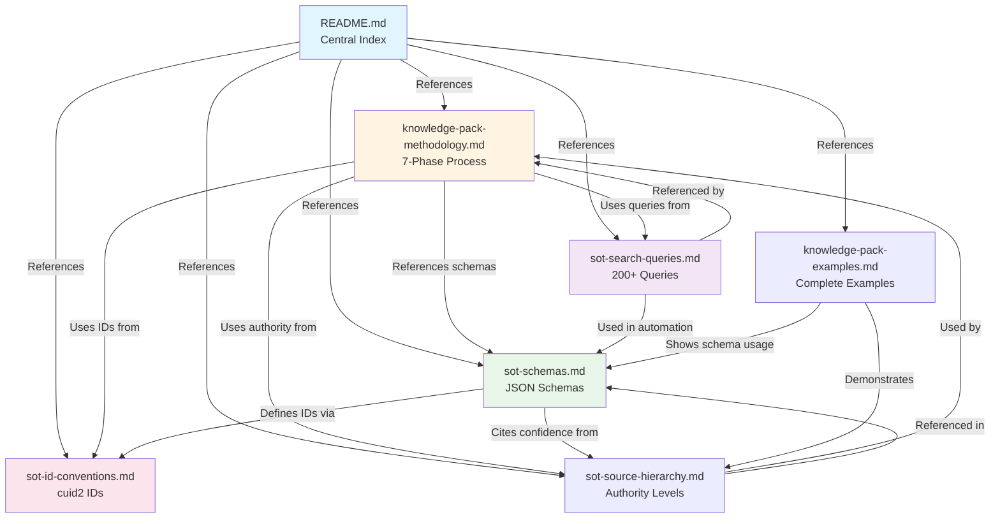

# Knowledge Pack Documentation

This directory contains comprehensive documentation for the Insurance Broker Quote Assistant knowledge pack data gathering methodology.

## Overview

The knowledge pack is a structured collection of insurance data (carriers, states, products, compliance rules) with complete source tracking and audit trails. Every data point is traceable to its original source with proper citations for regulatory compliance.

## Documentation Files

This section organizes documentation into two categories: **Single Source of Truth (SoT) Documents** which are canonical specifications for critical system components, and **Implementation Guides** which provide workflows and practical examples. Every decision in the knowledge pack system traces back to one of the SoT documents.

### Single Source of Truth (SoT) Documents 📌

These are authoritative specifications that serve as the definitive reference for their respective domains. Consult these first when questions arise about ID conventions, schema definitions, authority levels, or search methodology.

1. **[sot-id-conventions.md](sot-id-conventions.md)**
   **Authoritative cuid2 ID Specification**
   - cuid2 installation and setup
   - Prefix conventions for all entity types
   - ID generation algorithms and uniqueness guarantees
   - Complete reference for all ID-related decisions

2. **[sot-schemas.md](sot-schemas.md)**
   **Authoritative JSON Schema Definitions**
   - Field metadata envelope structure
   - Carrier, State, Product, Compliance schemas
   - Raw data schema for scraping phase
   - Conflict resolution schema
   - Source inheritance rules

3. **[sot-source-hierarchy.md](sot-source-hierarchy.md)**
   **Authoritative Authority Levels & Conflict Resolution**
   - 5-level authority hierarchy (Regulatory → Carrier → Industry → Comparison → Forums)
   - Confidence scoring formula: `(Authority × 0.5) + (Freshness × 0.3) + (Specificity × 0.2)`
   - 7-step conflict resolution decision tree
   - Resolution methods with examples

4. **[sot-search-queries.md](sot-search-queries.md)**
   **Authoritative Search Query Catalog**
   - 200+ organized search queries
   - Carrier operating states (20 queries)
   - Auto insurance discounts (35 queries)
   - Home insurance discounts (20 queries)
   - Eligibility requirements (40 queries)
   - State minimum requirements (30 queries)
   - Average pricing data (25 queries)
   - Broker commission (15 queries)
   - Compliance rules (15 queries)
   - Industry benchmarking (20 queries)

### Implementation Guides

These documents apply the SoT specifications to specific workflows and provide step-by-step guidance with real-world examples.

5. **[knowledge-pack-methodology.md](knowledge-pack-methodology.md)**
   **Complete 7-Phase Data Gathering Process**
   - Phase 1: Enhanced JSON Schema Design (1 hour)
   - Phase 2: Raw Data Scraping - preserve ALL sources (4-6 hours)
   - Phase 3: Conflict Detection (2-3 hours)
   - Phase 4: Conflict Resolution with 7 strategies (2-3 hours)
   - Phase 5: Knowledge Pack Assembly (1-2 hours)
   - Phase 6: Validation & QA (1-2 hours)
   - Phase 7: Documentation (1 hour)
   - **Total Time**: 12-18 hours

6. **[knowledge-pack-examples.md](knowledge-pack-examples.md)**
   **End-to-End Data Transformation Examples**
   - Example 1: Multi-policy discount (2 sources, simple conflict)
   - Example 2: CA auto minimums (regulatory authority override)
   - Example 3: Source inheritance (discount states)
   - Example 4: Three-way conflict with majority consensus
   - Example 5: Complete carrier file (production format)
   - Complete audit trail lineage examples

## Key Concepts

### Globally Unique IDs (cuid2)

All entities use **cuid2** for globally unique, collision-resistant identifiers. See [sot-id-conventions.md](sot-id-conventions.md) for complete specification with installation instructions and all prefix types.

### Source Tracking Requirements

✅ **Every data point has ≥1 source** (URI + element reference)  
✅ **Multiple sources allowed** per data point (captures conflicts)  
✅ **Child data points can inherit** parent sources  
✅ **Every data point has unique ID** (cuid2)  
✅ **Track ALL sources during scraping** (duplicates/conflicts preserved)  
✅ **Separate data cleaning phase** to resolve conflicts

### Source Authority Hierarchy

**Authority Hierarchy**: Sources are ranked by authority level (1-5). [View complete hierarchy →](sot-source-hierarchy.md#source-authority-levels)

## Single Source of Truth (SoT) Reference

The following documents serve as the canonical sources of truth for critical system specifications. Every data decision, ID generation, conflict resolution, and schema definition traces back to these authoritative references.

| Concept                             | SoT Document                                       | Description                                                                                                           |
| ----------------------------------- | -------------------------------------------------- | --------------------------------------------------------------------------------------------------------------------- |
| **cuid2 ID Specifications**         | [sot-id-conventions.md](sot-id-conventions.md)     | Authoritative source for all globally unique identifier conventions, prefixes, and generation methods                 |
| **JSON Schemas**                    | [sot-schemas.md](sot-schemas.md)                   | Authoritative source for all data structure definitions, field metadata envelopes, and schema specifications          |
| **Authority & Conflict Resolution** | [sot-source-hierarchy.md](sot-source-hierarchy.md) | Authoritative source for source authority levels (1-5), confidence scoring, and 7-step conflict resolution strategies |
| **Search Query Catalog**            | [sot-search-queries.md](sot-search-queries.md)     | Authoritative source for the complete catalog of 200+ search queries organized by data gathering category             |

**Architecture Principle**: All data in the knowledge pack system is traceable to its source via unique IDs and structured metadata. The SoT documents establish the single authoritative specification for each critical system component, ensuring consistency, auditability, and regulatory compliance. When in doubt about ID formats, data structures, authority rankings, or search methodology, consult the relevant SoT document first.

## Quick Start

### For Implementers

1. **Review** [knowledge-pack-methodology.md](knowledge-pack-methodology.md) for complete workflow
2. **Setup IDs**: See [sot-id-conventions.md](sot-id-conventions.md) for installation and ID generation
3. **Use** [sot-search-queries.md](sot-search-queries.md) to find data sources
4. **Apply** [sot-source-hierarchy.md](sot-source-hierarchy.md) when resolving conflicts
5. **Reference** [sot-schemas.md](sot-schemas.md) for data structure
6. **Follow** [knowledge-pack-examples.md](knowledge-pack-examples.md) for implementation patterns

### For Automated Data Gathering

The knowledge pack uses Brave Search API for automated data discovery:

1. Search queries are defined in [sot-search-queries.md](sot-search-queries.md)
2. Brave API enriches URLs with metadata (title, description, language, etc.)
3. URLs are fetched using crawl4ai for HTML and markdown extraction
4. Element references (CSS selectors or XPath) are captured - see [sot-schemas.md#source-object](sot-schemas.md#source-object)
5. cuid2 IDs are generated for all entities - see [sot-id-conventions.md](sot-id-conventions.md)
6. All data is saved to `knowledge_pack/raw/` directory

**Scripts location:** `knowledge-pack-scraper/scripts/` contains the automation tools (brave-search.py, fetch-url.py).

## Technology Stack

- **Package Manager**: Bun (all commands use `bun run`, `bun test`, `bun install`)
- **ID Generation**: See [sot-id-conventions.md](sot-id-conventions.md) for globally unique ID setup
- **Validation**: JSON Schema for data structure validation
- **Logging**: Structured JSON logs for audit trail

## Data Coverage

### Minimum Viable Dataset

- **Carriers**: 3 (GEICO, Progressive, State Farm)
- **States**: 5 (CA, TX, FL, NY, IL)
- **Products**: 4 (Auto, Home, Renters, Umbrella)
- **Discounts**: 6-8 per carrier
- **Data Points**: ~670 total

### Complete Dataset

All of the above plus:

- Broker compensation data
- Additional discount types
- More granular eligibility rules
- State-specific special requirements

## Documentation Structure

The following diagram shows the relationships between documentation files:



**Legend:**

- 🔵 **Blue** (README.md): Central index and quick-start guide
- 🟡 **Yellow** (knowledge-pack-methodology.md): Complete 7-phase workflow specification
- 🟢 **Green** (sot-schemas.md): Canonical JSON schema definitions (SoT for data structures)
- 🔴 **Pink** (sot-id-conventions.md): Canonical cuid2 ID specification (SoT for identifiers)
- 🟣 **Purple** (sot-search-queries.md): Complete search query catalog

---

## How to Use This Documentation

### If you want to...

**Understand the complete methodology:**

1. Start with [knowledge-pack-methodology.md](knowledge-pack-methodology.md) for 7-phase overview
2. Review [sot-source-hierarchy.md](sot-source-hierarchy.md) for conflict resolution
3. See [knowledge-pack-examples.md](knowledge-pack-examples.md) for practical applications

**Implement Phase 2 data gathering:**

1. Reference [sot-search-queries.md](sot-search-queries.md) for search query catalog
2. Use `knowledge-pack-scraper/scripts/brave-search.py` to execute searches via Brave API
3. Use `knowledge-pack-scraper/scripts/fetch-url.py` to fetch discovered URLs
4. Reference [sot-schemas.md](sot-schemas.md) for raw data format
5. Reference [sot-id-conventions.md](sot-id-conventions.md) for ID generation

**Create production JSON files:**

1. Review [sot-schemas.md](sot-schemas.md) for data structures
2. Review [sot-source-hierarchy.md](sot-source-hierarchy.md) for authority levels
3. Follow [knowledge-pack-examples.md](knowledge-pack-examples.md) for transformation patterns

**Generate unique IDs:**

1. See [sot-id-conventions.md](sot-id-conventions.md) for complete specification and setup instructions

---

## Key Terms Quick Reference

| Term                        | Definition                                                      | Learn More                                                                                                             |
| --------------------------- | --------------------------------------------------------------- | ---------------------------------------------------------------------------------------------------------------------- |
| **cuid2**                   | Globally unique identifier system (10-character cuid2 + prefix) | [sot-id-conventions.md](sot-id-conventions.md)                                                                         |
| **Field Metadata Envelope** | Data structure wrapping values with source tracking             | [sot-schemas.md#field-metadata-envelope](sot-schemas.md#field-metadata-envelope)                                       |
| **Source Authority Level**  | Ranking system (1-5) for source trustworthiness                 | [sot-source-hierarchy.md#source-authority-levels](sot-source-hierarchy.md#source-authority-levels)                     |
| **Conflict Resolution**     | Process for choosing between conflicting data                   | [sot-source-hierarchy.md#conflict-resolution-decision-tree](sot-source-hierarchy.md#conflict-resolution-decision-tree) |
| **Raw Data Entry**          | Unprocessed data captured during scraping                       | [sot-schemas.md#raw-data-schema](sot-schemas.md#raw-data-schema)                                                       |
| **Inheritance**             | Child data points borrowing parent sources                      | [sot-schemas.md#source-inheritance-rules](sot-schemas.md#source-inheritance-rules)                                     |
| **Websearch**               | Brave API search execution with raw request/response            | [sot-schemas.md#websearch-schema](sot-schemas.md#websearch-schema)                                                     |

**Note:** This is a quick reference only. Follow links for complete specifications.

---

## File Structure

See [knowledge-pack-methodology.md#phase-5-knowledge-pack-assembly](knowledge-pack-methodology.md#phase-5-knowledge-pack-assembly) for complete directory structure and file organization.

## Success Criteria

See [knowledge-pack-methodology.md#success-criteria](knowledge-pack-methodology.md#success-criteria) for complete success criteria and validation requirements.

## Benefits

1. **Full Auditability**: Trace any recommendation to original source
2. **Conflict Transparency**: All disagreements documented
3. **Source Diversity**: Multiple sources strengthen data
4. **Change Tracking**: Update individual sources without rebuilding
5. **Regulatory Defense**: Complete citation trail for compliance
6. **Quality Assurance**: Automated validation catches errors

## Commands Reference

```bash
# Install dependencies
bun install

# Run validation
bun run validate-kb

# Detect conflicts
bun run detect-conflicts

# Resolve conflicts (interactive)
bun run resolve-conflicts

# Generate production files
bun run assemble-kb

# Run tests
bun test
```

---

**Last Updated**: 2025-11-05  
**Status**: Ready for Implementation
