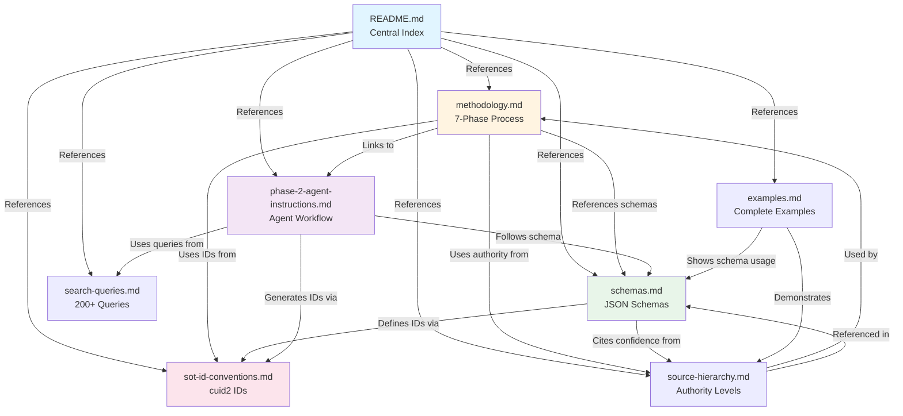

# Knowledge Pack Documentation

This directory contains comprehensive documentation for the Insurance Broker Quote Assistant knowledge pack data gathering methodology.

## Overview

The knowledge pack is a structured collection of insurance data (carriers, states, products, compliance rules) with complete source tracking and audit trails. Every data point is traceable to its original source with proper citations for regulatory compliance.

## Documentation Files

### 1. [methodology.md](knowledge-pack-methodology.md)
**Complete 7-Phase Data Gathering Process**
- Phase 1: Enhanced JSON Schema Design (1 hour)
- Phase 2: Raw Data Scraping - preserve ALL sources (4-6 hours)
- Phase 3: Conflict Detection (2-3 hours)
- Phase 4: Conflict Resolution with 7 strategies (2-3 hours)
- Phase 5: Knowledge Pack Assembly (1-2 hours)
- Phase 6: Validation & QA (1-2 hours)
- Phase 7: Documentation (1 hour)

**Total Time**: 12-18 hours

### 2. [schemas.md](sot-schemas.md)
**JSON Schema Definitions with Source Tracking**
- Field metadata envelope structure
- Carrier, State, Product, Compliance schemas
- Raw data schema for scraping phase
- Conflict resolution schema
- ID generation conventions (cuid2-based)
- Source inheritance rules

### 3. [search-queries.md](sot-search-queries.md)
**200+ Search Queries for Data Gathering**

Organized by category:
- Carrier operating states (20 queries)
- Auto insurance discounts (35 queries)
- Home insurance discounts (20 queries)
- Eligibility requirements (40 queries)
- State minimum requirements (30 queries)
- Average pricing data (25 queries)
- Broker commission (15 queries)
- State-specific requirements (25+ queries)
- Compliance rules (15 queries)
- Industry benchmarking (20 queries)

### 4. [source-hierarchy.md](sot-source-hierarchy.md)
**Source Authority Levels & Conflict Resolution**
- 5-level authority hierarchy (Regulatory → Carrier → Industry → Comparison → Forums)
- Confidence scoring formula: `(Authority × 0.5) + (Freshness × 0.3) + (Specificity × 0.2)`
- 7-step conflict resolution decision tree
- Resolution methods with examples
- Special cases & edge cases handling

### 5. [examples.md](knowledge-pack-examples.md)
**End-to-End Data Transformation Examples**
- Example 1: Multi-policy discount (2 sources, simple conflict)
- Example 2: CA auto minimums (regulatory authority override)
- Example 3: Source inheritance (discount states)
- Example 4: Three-way conflict with majority consensus
- Example 5: Complete carrier file (production format)
- Complete audit trail lineage examples

## Key Concepts

### Globally Unique IDs (cuid2)

All entities use **cuid2** for globally unique, collision-resistant identifiers. See [sot-id-conventions.md](sot-id-conventions.md) for complete specification with installation instructions and all prefix types.

### Source Tracking Requirements

✅ **Every data point has ≥1 source** (URI + element reference)  
✅ **Multiple sources allowed** per data point (captures conflicts)  
✅ **Child data points can inherit** parent sources  
✅ **Every data point has unique ID** (cuid2)  
✅ **Track ALL sources during scraping** (duplicates/conflicts preserved)  
✅ **Separate data cleaning phase** to resolve conflicts

### Source Authority Hierarchy

Sources are ranked by authority level (1-5, regulatory > carrier > industry > comparison > forums). See [sot-source-hierarchy.md](sot-source-hierarchy.md) for complete hierarchy and conflict resolution strategies.

**Quick reference:**
1. Level 5 - Regulatory (State insurance departments)
2. Level 4 - Primary (Carrier official sites)
3. Level 3 - Reference (Industry organizations)
4. Level 2 - Secondary (Financial/comparison sites)
5. Level 1 - Tertiary (User-generated content)

[View complete hierarchy →](sot-source-hierarchy.md#source-authority-levels)

## Quick Start

### For Implementers

1. **Review** [methodology.md](knowledge-pack-methodology.md) for complete workflow
2. **Setup IDs**: See [sot-id-conventions.md](sot-id-conventions.md) for installation and ID generation
3. **Use** [search-queries.md](sot-search-queries.md) to find data sources
4. **Apply** [source-hierarchy.md](sot-source-hierarchy.md) when resolving conflicts
5. **Reference** [schemas.md](sot-schemas.md) for data structure
6. **Follow** [examples.md](knowledge-pack-examples.md) for implementation patterns

### For Automated Agents

Search agents should:
1. Use search queries from [search-queries.md](sot-search-queries.md)
2. Capture element references (CSS selectors or XPath) - see [schemas.md#source-object](sot-schemas.md#source-object)
3. Generate cuid2 IDs for each raw data entry - see [sot-id-conventions.md](sot-id-conventions.md)
4. Record all findings (even duplicates/conflicts)
5. Save to `knowledge_pack/raw/` directory

**Complete agent workflow:** See [phase-2-agent-instructions.md](phase-2-agent-instructions.md) for step-by-step autonomous execution guide.

## Technology Stack

- **Package Manager**: Bun (all commands use `bun run`, `bun test`, `bun install`)
- **ID Generation**: See [sot-id-conventions.md](sot-id-conventions.md) for globally unique ID setup
- **Validation**: JSON Schema for data structure validation
- **Logging**: Structured JSON logs for audit trail

## Data Coverage

### Minimum Viable Dataset
- **Carriers**: 3 (GEICO, Progressive, State Farm)
- **States**: 5 (CA, TX, FL, NY, IL)
- **Products**: 4 (Auto, Home, Renters, Umbrella)
- **Discounts**: 6-8 per carrier
- **Data Points**: ~670 total

### Complete Dataset
All of the above plus:
- Broker compensation data
- Additional discount types
- More granular eligibility rules
- State-specific special requirements

## Documentation Structure

The following diagram shows the relationships between documentation files:



**Legend:**
- 🔵 **Blue** (README.md): Central index and quick-start guide
- 🟡 **Yellow** (methodology.md): Complete 7-phase workflow specification
- 🟢 **Green** (schemas.md): Canonical JSON schema definitions (SoT for data structures)
- 🔴 **Pink** (sot-id-conventions.md): Canonical cuid2 ID specification (SoT for identifiers)
- 🟣 **Purple** (phase-2-agent-instructions.md): Autonomous agent operational spec

---

## How to Use This Documentation

### If you want to...

**Understand the complete methodology:**
1. Start with [methodology.md](knowledge-pack-methodology.md) for 7-phase overview
2. Review [source-hierarchy.md](sot-source-hierarchy.md) for conflict resolution
3. See [examples.md](knowledge-pack-examples.md) for practical applications

**Implement Phase 2 data gathering:**
1. Start with [phase-2-agent-instructions.md](phase-2-agent-instructions.md) for step-by-step workflow
2. Reference [search-queries.md](sot-search-queries.md) for search terms
3. Reference [schemas.md](sot-schemas.md) for raw data format
4. Reference [sot-id-conventions.md](sot-id-conventions.md) for ID generation

**Create production JSON files:**
1. Review [schemas.md](sot-schemas.md) for data structures
2. Review [source-hierarchy.md](sot-source-hierarchy.md) for authority levels
3. Follow [examples.md](knowledge-pack-examples.md) for transformation patterns

**Generate unique IDs:**
1. See [sot-id-conventions.md](sot-id-conventions.md) for complete specification and setup instructions

---

## Key Terms Quick Reference

| Term | Definition | Learn More |
|------|------------|------------|
| **cuid2** | Globally unique 10-character identifier system | [sot-id-conventions.md](sot-id-conventions.md) |
| **Field Metadata Envelope** | Data structure wrapping values with source tracking | [schemas.md#field-metadata-envelope](sot-schemas.md#field-metadata-envelope) |
| **Source Authority Level** | Ranking system (1-5) for source trustworthiness | [source-hierarchy.md#source-authority-levels](sot-source-hierarchy.md#source-authority-levels) |
| **Conflict Resolution** | Process for choosing between conflicting data | [source-hierarchy.md#conflict-resolution-decision-tree](sot-source-hierarchy.md#conflict-resolution-decision-tree) |
| **Raw Data Entry** | Unprocessed data captured during scraping | [schemas.md#raw-data-schema](sot-schemas.md#raw-data-schema) |
| **Inheritance** | Child data points borrowing parent sources | [schemas.md#source-inheritance-rules](sot-schemas.md#source-inheritance-rules) |
| **Page File** | Saved HTML/PDF content with unique cuid2 ID | [phase-2-agent-instructions.md#page-files](phase-2-agent-instructions.md#page-files) |

**Note:** This is a quick reference only. Follow links for complete specifications.

---

## File Structure

```
knowledge_pack/
├── carriers/          # Production carrier files
├── states/            # Production state files
├── raw/               # Raw scraped data (preserved)
├── clean/             # Cleaned data with resolutions
├── schemas/           # JSON schemas
├── conflicts.json     # Detected conflicts
├── resolutions.json   # Resolution decisions
├── audit-trail.json   # Complete data lineage
└── README.md          # Documentation
```

## Success Criteria

✅ Every data point has cuid2 ID  
✅ Every data point has ≥1 source OR inheritedFrom  
✅ All conflicts detected and resolved  
✅ Complete audit trail from raw → production  
✅ Validation passes (no unsourced data)  
✅ README.md with full methodology

## Benefits

1. **Full Auditability**: Trace any recommendation to original source
2. **Conflict Transparency**: All disagreements documented
3. **Source Diversity**: Multiple sources strengthen data
4. **Change Tracking**: Update individual sources without rebuilding
5. **Regulatory Defense**: Complete citation trail for compliance
6. **Quality Assurance**: Automated validation catches errors

## Commands Reference

```bash
# Install dependencies
bun install

# Run validation
bun run validate-kb

# Detect conflicts
bun run detect-conflicts

# Resolve conflicts (interactive)
bun run resolve-conflicts

# Generate production files
bun run assemble-kb

# Run tests
bun test
```

---

**Last Updated**: 2025-11-05  
**Status**: Ready for Implementation
