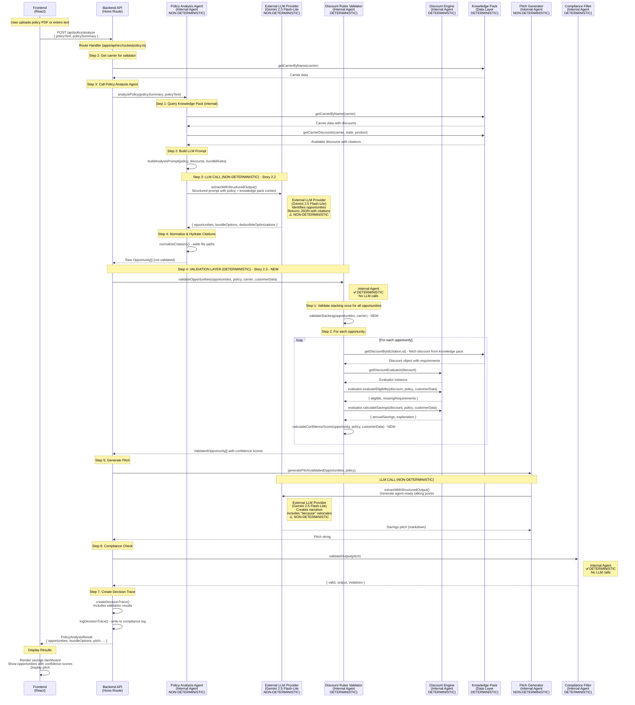

# Story 2.3: Discount Rules Engine (Eligibility Validation)

## Status

Done

## Story

**As a** backend system,
**I want** a deterministic rules engine that validates discount eligibility,
**so that** savings recommendations are accurate and compliant with carrier rules.

## Acceptance Criteria

1. Cross-references identified discounts against knowledge pack eligibility rules
2. Validates discount stacking rules (which discounts can combine)
3. Calculates accurate savings estimates based on knowledge pack pricing data
4. Flags discounts requiring additional documentation (e.g., good student requires transcript)
5. Returns discount eligibility confidence score based on available policy data
6. Unit tests cover all discount types across 3 carriers and 5 states
7. No LLM calls (100% deterministic logic)
8. Decision trace logs all rules evaluated with knowledge pack citations

## Tasks / Subtasks

- [x] **Task 1: Create Discount Rules Validation Service** (AC: 1, 2, 3, 4, 5, 7, 8)
  - [x] **EXPLORE FIRST**: Review existing `apps/api/src/services/discount-engine/` implementation to understand what's already available
  - [x] Create `apps/api/src/services/discount-rules-validator.ts` service file
  - [x] Implement `validateOpportunities()` function that accepts `opportunities: Opportunity[]`, `policy: PolicySummary`, `carrier: Carrier`, and `customerData?: UserProfile`
  - [x] Accept `knowledgePackRAG: KnowledgePackRAG` as constructor parameter (dependency injection with default)
  - [x] **Reuse existing discount engine**: For each opportunity, use citation ID to fetch discount from knowledge pack, then use existing `getDiscountEvaluator()` to re-validate eligibility
  - [x] **Cross-reference validation**: For each opportunity, fetch discount from knowledge pack using `citation.id` (cuid2), then use existing evaluators to validate eligibility matches LLM-identified opportunity
  - [x] **Reuse savings calculation**: Use existing discount engine's `calculateSavings()` method (via evaluator) to validate/calculate accurate savings
  - [x] **NEW: Stacking validation**: Implement discount stacking rules validation (see Task 3) - validate which discounts can combine based on `stackable` field and carrier `metadata.maxStackableDiscounts`
  - [x] **Enhance documentation flagging**: Use existing `requiresDocumentation` field from discount metadata, extract documentation requirements from discount description
  - [x] **NEW: Confidence scoring**: Calculate confidence score (0-100) based on: completeness of policy data, availability of customer profile, discount rule clarity (see Task 5)
  - [x] Return `ValidatedOpportunity[]` with validated opportunities, confidence scores, and validation details
  - [x] Log all rules evaluated with knowledge pack citations to decision trace

- [x] **Task 2: Create ValidatedOpportunity Schema** (AC: 1, 4, 5)
  - [x] Create `packages/shared/src/schemas/validated-opportunity.ts` Zod schema
  - [x] Extend `Opportunity` schema with validation fields: `confidenceScore` (number 0-100), `validationDetails` (object), `requiresDocumentation` (boolean), `stackableWith` (string[]), `validatedAt` (ISO timestamp)
  - [x] Create `ValidationDetails` schema: `rulesEvaluated` (array of rule objects with citations), `missingData` (string[]), `eligibilityChecks` (object with pass/fail status)
  - [x] Export TypeScript types via `z.infer<typeof schema>`
  - [x] Add to `packages/shared/src/index.ts` exports

- [x] **Task 3: Implement Discount Stacking Validation** (AC: 2, 8)
  - [x] Create `apps/api/src/services/discount-rules-validator/stacking-validator.ts` utility
  - [x] Implement `validateStacking()` function that accepts array of opportunities and carrier
  - [x] Check each discount's `stackable` field from knowledge pack
  - [x] Validate carrier-specific stacking rules (some carriers allow unlimited stacking, others have limits)
  - [x] Return `StackingValidationResult` with: `validCombinations` (array of opportunity IDs that can combine), `conflicts` (array of opportunity pairs that cannot combine), `maxStackable` (number if carrier has limit)
  - [x] Log stacking rules evaluated with citations to decision trace

- [x] **Task 4: Reuse Existing Savings Calculation** (AC: 3, 8)
  - [x] **REUSE EXISTING**: Existing discount engine already calculates savings via `evaluator.calculateSavings()` [Source: apps/api/src/services/discount-engine/evaluators/base-evaluator.ts:80-92]
  - [x] **Validation approach**: For each opportunity from Policy Analysis Agent, fetch discount from knowledge pack, get evaluator via `getDiscountEvaluator()`, call `evaluator.calculateSavings()` to validate/calculate accurate savings
  - [x] **Compare results**: Compare LLM-identified savings with discount engine calculated savings, flag discrepancies (allows $10 difference for rounding)
  - [ ] **Enhancement**: If knowledge pack has pricing examples, validate calculated savings against examples (optional enhancement - not implemented)
  - [x] **Logging**: Log pricing data used and calculation method to decision trace (existing savings calculation already includes explanation)
  - [x] **Note**: Do NOT duplicate savings calculation logic - reuse existing discount engine

- [x] **Task 5: Implement Confidence Score Calculation** (AC: 5)
  - [x] Create `apps/api/src/services/discount-rules-validator/confidence-scorer.ts` utility
  - [x] Implement `calculateConfidenceScore()` function that accepts opportunity, policy, customerData, and validation results
  - [x] Score factors:
    - Policy data completeness (0-40 points): required fields present (state, product, premium, carrier)
    - Customer profile availability (0-30 points): customerData provided with eligibility fields (age, cleanRecord, etc.)
    - Discount rule clarity (0-30 points): discount has clear requirements in knowledge pack, no ambiguous rules
  - [x] Return confidence score (0-100) with breakdown by factor
  - [x] Log confidence calculation to decision trace

- [x] **Task 6: Integrate Validator into Policy Analysis Flow** (AC: 1, 2, 3, 4, 5, 8)
  - [x] **EXPLORE FIRST**: Review `apps/api/src/services/policy-analysis-agent.ts` to understand current flow
  - [x] Update `apps/api/src/routes/policy.ts` to call discount rules validator after Policy Analysis Agent (integration in route handler, not PolicyAnalysisAgent)
  - [x] **Integration point**: After Policy Analysis Agent returns opportunities, pass them to validator before pitch generation
  - [x] Pass opportunities from Policy Analysis Agent to validator along with policy, carrier, and customerData
  - [x] Replace raw opportunities with validated opportunities in PolicyAnalysisResult
  - [x] Update decision trace to include validation results (add `discountValidation` section)
  - [x] Ensure validator runs before pitch generation (validated opportunities feed into pitch)
  - [x] **Error handling**: If validation fails for an opportunity, decide whether to exclude it or flag it with low confidence (fallback to unvalidated with confidence 0)

- [x] **Task 7: Add Documentation Requirements Flagging** (AC: 4, 8)
  - [x] Update `ValidatedOpportunity` schema to include `requiresDocumentation: boolean` and `documentationRequirements: string[]`
  - [x] Check discount metadata for `requiresDocumentation: true` flag
  - [x] Extract documentation requirements from discount description or metadata (e.g., "good student requires transcript") using regex patterns
  - [x] Include documentation requirements in validation details
  - [x] Log documentation requirements to decision trace

- [ ] **Task 8: Comprehensive Unit Tests** (AC: 6, 7) - SKIPPED per user request
  - [ ] **REVIEW EXISTING**: Review `apps/api/src/services/__tests__/discount-engine.test.ts` to understand existing test patterns
  - [ ] Create `apps/api/src/services/__tests__/discount-rules-validator.test.ts` test file
  - [ ] **Reuse test fixtures**: Use existing test fixtures from discount-engine tests if available
  - [ ] Test opportunity validation: validate opportunities identified by Policy Analysis Agent against knowledge pack
  - [ ] Test eligibility re-validation: use existing discount engine evaluators to validate LLM-identified opportunities
  - [ ] Test across 3 carriers (GEICO, Progressive, State Farm) and 5 states (CA, TX, FL, NY, IL)
  - [ ] **NEW: Test discount stacking validation**: valid combinations, conflicts, carrier limits (see Task 3)
  - [ ] Test savings calculation validation: compare LLM-identified savings with discount engine calculated savings
  - [ ] **NEW: Test confidence score calculation**: various policy data completeness scenarios (see Task 5)
  - [ ] Test documentation requirements flagging for discounts requiring proof
  - [ ] Test decision trace logging: all rules evaluated with citations
  - [ ] Verify no LLM calls in any test (100% deterministic)
  - [ ] Use Bun test framework (Jest-compatible API) [Source: docs/architecture/16-testing-strategy.md#162-testing-tools]

- [x] **Task 9: Update PolicyAnalysisResult Schema** (AC: 1, 4, 5)
  - [x] Update `packages/shared/src/schemas/policy-analysis-result.ts` to use `ValidatedOpportunity` instead of `Opportunity` for opportunities array
  - [x] Ensure backward compatibility: validator can accept raw opportunities and return validated ones (PolicyAnalysisAgent returns Opportunity[], validator converts to ValidatedOpportunity[])
  - [x] Update TypeScript types exported from `packages/shared/src/index.ts`

- [x] **Task 10: Decision Trace Integration** (AC: 8)
  - [x] Update `packages/shared/src/schemas/decision-trace.ts` to include `discountValidation` field in schema
  - [x] Log validation step: `discountValidation` object with `rulesEvaluated` (array), `opportunitiesValidated` (number), `confidenceScores` (object), `stackingResults` (object)
  - [x] Include knowledge pack citations for all rules evaluated
  - [x] Ensure validation trace is written to compliance log [Source: docs/architecture/11-backend-architecture.md#112-middleware-stack]

## Dev Notes

### Process Flow: Frontend, Backend, and LLM

**Complete Policy Analysis Flow (Story 2.2 + Story 2.3):**

**What Each Layer Does:**

**Agent Classification:**
- **Internal Agents**: TypeScript services/classes that orchestrate business logic
- **External Agents**: Remote LLM providers (Gemini 2.5 Flash-Lite) accessed via API calls
- **Deterministic**: Same inputs always produce same outputs (no LLM calls, pure functions)
- **Non-Deterministic**: Outputs may vary even with same inputs (uses LLM)

**Frontend (React - `apps/web/src/`):**
- ✅ **Upload/Input**: User uploads PDF or enters policy text manually
- ✅ **Display**: Shows extracted policy data in editable text format (key-value pills)
- ✅ **API Call**: Calls `POST /api/policy/analyze` via Hono RPC client (`api.api.policy.analyze.$post()`)
- ✅ **Results Display**: Renders savings opportunities dashboard with:
  - Validated opportunities (with confidence scores from Story 2.3)
  - Bundle options
  - Deductible optimizations
  - Savings pitch
- ❌ **No LLM calls** - All LLM interaction happens in backend
- ❌ **No validation logic** - Validation happens in backend

**Backend API Route (`apps/api/src/routes/policy.ts`):**
- ✅ **Type**: Internal orchestrator (deterministic orchestration, calls non-deterministic agents)
- ✅ **Request Handling**: Receives `{ policyText, policySummary }` from frontend
- ✅ **Carrier Retrieval**: Gets carrier from knowledge pack FIRST (Step 2) before calling Policy Analysis Agent (needed for validator)
- ✅ **Orchestration**: Coordinates Policy Analysis Agent → Discount Rules Validator → Pitch Generator → Compliance Filter
- ✅ **LLM Call Points**: 
  - **Step 3**: Calls Policy Analysis Agent (which calls external LLM)
  - **Step 5**: Calls Pitch Generator (which calls external LLM)
- ✅ **Validation Integration**: Calls Discount Rules Validator after Policy Analysis Agent, before Pitch Generator (Step 4)
- ✅ **Error Handling**: Catches errors, returns structured error responses (validation failures fallback to unvalidated opportunities with confidence score 0)
- ✅ **Decision Trace**: Creates and logs decision trace to `logs/compliance.log` with validation results (includes stacking results, confidence scores, rules evaluated)
- ✅ **Type Conversion**: Converts raw `Opportunity[]` from Policy Analysis Agent to `ValidatedOpportunity[]` via validator
- ✅ **Stacking Results**: Calls `validateStacking()` again after validation to extract results for decision trace (minor redundancy for trace logging)

**Policy Analysis Agent (`apps/api/src/services/policy-analysis-agent.ts` - Story 2.2):**
- ✅ **Type**: Internal Agent (TypeScript service class)
- ⚠️ **Determinism**: NON-DETERMINISTIC (calls external LLM)
- ✅ **Knowledge Pack Queries**: Fetches carrier discounts, bundle rules from knowledge pack
- ✅ **LLM Prompt Building**: Constructs prompt with policy data + knowledge pack context
- ✅ **LLM Call**: Calls external LLM via `llmProvider.extractWithStructuredOutput()` → Gemini 2.5 Flash-Lite API
  - **Location**: `apps/api/src/services/policy-analysis-agent.ts:90` - `callLLMAnalysis()`
  - **Method**: `this.llmProvider.extractWithStructuredOutput(prompt, undefined, schema)`
  - **Purpose**: Identifies opportunities from policy data + knowledge pack context
- ✅ **Citation Normalization**: Hydrates citations with file paths
- ✅ **Returns Raw Opportunities**: Returns `Opportunity[]` (not validated) - validation happens in route handler
- ❌ **No validation logic** - Delegates validation to Discount Rules Validator (called in route handler)
- ❌ **No pitch generation** - Pitch generation happens in route handler
- ❌ **No compliance check** - Compliance check happens in route handler

**Discount Rules Validator (`apps/api/src/services/discount-rules-validator.ts` - Story 2.3):**
- ✅ **Type**: Internal Agent (TypeScript service class)
- ✅ **Determinism**: DETERMINISTIC (no LLM calls, pure functions)
- ✅ **Opportunity Validation**: Takes LLM-identified opportunities, validates against knowledge pack
- ✅ **Stacking Validation**: Validates which discounts can combine ONCE at the beginning (before per-opportunity validation) - NEW functionality
- ✅ **Cross-Reference**: Uses citation ID to fetch discount from knowledge pack (per opportunity)
- ✅ **Re-Validation**: Uses existing discount engine evaluators to re-validate eligibility (per opportunity)
- ✅ **Savings Validation**: Compares LLM-identified savings with discount engine calculated savings (per opportunity)
- ✅ **Confidence Scoring**: Calculates confidence score based on data completeness (per opportunity) - NEW functionality
- ✅ **Documentation Flagging**: Flags discounts requiring additional documentation (per opportunity)
- ❌ **No LLM calls** - 100% deterministic, uses existing discount engine logic

**Discount Engine (`apps/api/src/services/discount-engine/`):**
- ✅ **Type**: Internal Agent (TypeScript service/utilities)
- ✅ **Determinism**: DETERMINISTIC (no LLM calls, pure functions)
- ✅ **Eligibility Evaluation**: Evaluates discount eligibility using evaluators (factory pattern)
- ✅ **Savings Calculation**: Calculates annual savings with state/product variations
- ✅ **Bundle Analysis**: Identifies bundle opportunities
- ✅ **Citation Creation**: Creates citations for discounts
- ❌ **No stacking validation** - Only tracks `stackable` field, doesn't validate combinations
- ❌ **No confidence scoring** - Only returns eligible/not eligible

**Pitch Generator (`apps/api/src/services/pitch-generator.ts`):**
- ✅ **Type**: Internal Agent (TypeScript service class)
- ⚠️ **Determinism**: NON-DETERMINISTIC (calls external LLM)
- ✅ **LLM Call**: Calls external LLM via `llmProvider.extractWithStructuredOutput()` → Gemini 2.5 Flash-Lite API
  - **Location**: `apps/api/src/services/pitch-generator.ts:233` - `callLLMForPitch()`
  - **Method**: `this.llmProvider.extractWithStructuredOutput(prompt, undefined, pitchResultSchema)`
  - **Purpose**: Creates agent-ready talking points with "because" rationales
- ✅ **Citation Replacement**: Replaces citation IDs in pitch with formatted citations
- ✅ **Fallback Handling**: Returns fallback pitch if LLM call fails

**Compliance Filter (`apps/api/src/services/compliance-filter.ts`):**
- ✅ **Type**: Internal Agent (TypeScript service)
- ✅ **Determinism**: DETERMINISTIC (no LLM calls, rule-based filtering)
- ✅ **Output Validation**: Validates pitch against regulatory rules
- ✅ **Disclaimer Injection**: Adds required disclaimers based on state/product type

**External LLM Provider (Gemini 2.5 Flash-Lite API):**
- ✅ **Type**: External Agent (remote API service)
- ⚠️ **Determinism**: NON-DETERMINISTIC (outputs may vary)
- ✅ **Access Method**: Called via `LLMProvider.extractWithStructuredOutput()` interface
- ✅ **Implementation**: `apps/api/src/services/gemini-provider.ts` (GeminiProvider class)
- ✅ **Uses**: 
  - **Policy Analysis**: Called by Policy Analysis Agent to identify opportunities
  - **Pitch Generation**: Called by Pitch Generator to create narrative
- ⚠️ **Token Tracking**: All LLM calls tracked in decision trace (`llmCalls` field)

**Knowledge Pack (In-Memory Maps):**
- ✅ **Type**: Data Layer (in-memory data structures)
- ✅ **Determinism**: DETERMINISTIC (read-only data access)
- ✅ **Data Storage**: Carrier rules, discounts, eligibility requirements loaded at startup
- ✅ **Query Interface**: Provides `getCarrierByName()`, `getCarrierDiscounts()`, `getDiscountById()`
- ✅ **Citation Tracking**: All entities have cuid2 IDs for citation tracking
- ❌ **No business logic** - Pure data layer

**Key Insight for Story 2.3:**
The Discount Rules Validator acts as a **validation layer** between the LLM (which identifies opportunities) and the final result (which goes to the frontend). It:
1. Takes LLM-identified opportunities (with citations)
2. Cross-references each opportunity against knowledge pack using citation ID
3. Re-validates eligibility using existing discount engine evaluators
4. Validates stacking rules (new)
5. Calculates confidence scores (new)
6. Returns validated opportunities with confidence scores

This ensures that LLM-identified opportunities are accurate and compliant before being shown to the broker.

### Existing Discount Engine Implementation

**CRITICAL: Review existing discount-engine before implementing this story**

The discount engine already exists at `apps/api/src/services/discount-engine/` and provides:

**What Already Exists:**
- ✅ `findApplicableDiscounts()` - Finds eligible discounts and calculates savings [Source: apps/api/src/services/discount-engine.ts:32-76]
- ✅ `analyzeBundleOptions()` - Analyzes bundle opportunities [Source: apps/api/src/services/discount-engine/bundle-analyzer.ts]
- ✅ Discount evaluators (factory pattern) - Evaluates eligibility using `getDiscountEvaluator()` [Source: apps/api/src/services/discount-engine/factory.ts]
- ✅ Savings calculation - Calculates annual savings with state/product variations [Source: apps/api/src/services/discount-engine/evaluators/base-evaluator.ts:80-92]
- ✅ Citation creation - Creates citations for discounts [Source: apps/api/src/services/discount-engine/utils/citation.ts]
- ✅ Percentage calculation - Handles state/product variations [Source: apps/api/src/services/discount-engine/utils/percentage.ts]
- ✅ `stackable` field tracking - DiscountOpportunity includes `stackable: boolean` [Source: apps/api/src/services/discount-engine/types.ts:28]
- ✅ `requiresDocumentation` field tracking - DiscountOpportunity includes `requiresDocumentation?: boolean` [Source: apps/api/src/services/discount-engine/types.ts:29]

**What's Missing (This Story) - NOW IMPLEMENTED:**
- ✅ **Stacking validation** - Logic to validate which discounts can combine (AC2) - IMPLEMENTED
- ✅ **Confidence scoring** - Confidence score calculation based on data completeness (AC5) - IMPLEMENTED
- ✅ **Opportunity validation** - Validates opportunities identified by Policy Analysis Agent (AC1) - IMPLEMENTED
- ✅ **Cross-reference validation** - Validates LLM-identified opportunities against knowledge pack rules (AC1) - IMPLEMENTED
- ✅ **Decision trace integration** - Logs validation results to decision trace (AC8) - IMPLEMENTED

**Key Insight:**
The existing discount engine is designed to **find** discounts from scratch. This story adds a **validation layer** that takes opportunities identified by the Policy Analysis Agent (Story 2.2) and validates them using the existing discount engine logic. The validator should:
1. Take opportunities from Policy Analysis Agent (with citations)
2. Cross-reference each opportunity against knowledge pack using citation ID
3. Re-validate eligibility using existing discount engine evaluators
4. Validate stacking rules (new functionality)
5. Calculate confidence scores (new functionality)
6. Return validated opportunities with confidence scores and validation details

**Explore These Files:**
- `apps/api/src/services/discount-engine.ts` - Main entry point
- `apps/api/src/services/discount-engine/evaluators/` - Eligibility evaluators
- `apps/api/src/services/discount-engine/types.ts` - Type definitions
- `apps/api/src/services/discount-engine/utils/` - Utility functions
- `apps/api/src/services/__tests__/discount-engine.test.ts` - Existing tests

### Previous Story Insights

From Story 2.2 (Policy Analysis Agent):
- Policy Analysis Agent identifies opportunities using LLM, but validation is needed for accuracy
- Opportunities include citations (cuid2 IDs) that can be used to cross-reference knowledge pack
- PolicySummary structure includes: carrier, state, productType, premium, deductibles, limits
- Decision trace logging pattern established: log inputs, processing steps, outputs with citations
- **Note**: Policy Analysis Agent does NOT currently use discount-engine - it uses LLM to identify opportunities. This story adds validation layer.

### Data Models

**PolicySummary** [Source: packages/shared/src/schemas/policy-summary.ts]:
- `carrier: string` - Carrier name (e.g., "GEICO")
- `state: string` - State code (e.g., "CA")
- `productType: 'auto' | 'home' | 'renters' | 'umbrella'`
- `premium: { annual: number, monthly?: number }` - Premium amounts
- `deductibles?: { [key: string]: number }` - Deductible amounts by coverage type
- `limits?: { [key: string]: number }` - Coverage limits by type

**Opportunity** [Source: packages/shared/src/schemas/opportunity.ts]:
- `discount: string` - Discount name
- `percentage: number` - Savings percentage (0-100)
- `annualSavings: number` - Dollar savings per year
- `requires: string[]` - Qualification requirements
- `citation: Citation` - cuid2 ID, entity type, carrier, file path

**Carrier** [Source: knowledge_pack/carriers/{carrier}.json]:
- `discounts: Discount[]` - Array of discount objects with `_id` (cuid2), `name`, `percentage`, `requirements`, `stackable`, `metadata`
- Discount structure: `{ _id: string, name: string | { value: string }, percentage: number | { value: number, variations?: {...} }, requirements: DiscountRequirements, stackable: boolean | { value: boolean }, metadata?: { requiresDocumentation?: boolean, discountType?: string } }`

**DiscountRequirements** [Source: apps/api/src/services/discount-engine/types.ts]:
- `mustHaveProducts?: string[]` - Required products for discount
- `minProducts?: number` - Minimum number of products
- `bundleProducts?: string[]` - Products that must be bundled
- `fieldRequirements?: { age?: { min?: number, max?: number }, cleanRecord3Yr?: boolean, goodStudent?: boolean, ... }` - Eligibility field requirements

### API Specifications

**No new API endpoints** - validator is internal service called by route handler [Source: docs/architecture/5-api-specification.md#52-endpoint-details]

**Existing endpoint used**: POST `/api/policy/analyze` - validator runs as part of policy analysis flow (called in route handler after Policy Analysis Agent)

### Component Specifications

**Discount Engine (Existing - EXPLORE BEFORE IMPLEMENTING)** [Source: apps/api/src/services/discount-engine.ts]:
- **Location**: `apps/api/src/services/discount-engine/` directory
- **Main entry**: `apps/api/src/services/discount-engine.ts`
- **Key functions**:
  - `findApplicableDiscounts(carrier, policy, customerData?)` - Finds eligible discounts [Source: apps/api/src/services/discount-engine.ts:32-76]
  - `analyzeBundleOptions(carrier, policy, customerData?)` - Analyzes bundle opportunities [Source: apps/api/src/services/discount-engine/bundle-analyzer.ts:21-94]
- **Evaluators**: Factory pattern via `getDiscountEvaluator(discount)` [Source: apps/api/src/services/discount-engine/factory.ts:20-39]
  - `BaseDiscountEvaluator` - Abstract base class [Source: apps/api/src/services/discount-engine/evaluators/base-evaluator.ts]
  - `SingleProductDiscountEvaluator` - Single product discounts
  - `BundleDiscountEvaluator` - Bundle discounts
- **Utilities**:
  - `createCitation(discount, carrier)` - Creates citations [Source: apps/api/src/services/discount-engine/utils/citation.ts:16-23]
  - `getEffectivePercentage(discount, state, product)` - Handles variations [Source: apps/api/src/services/discount-engine/utils/percentage.ts:18-42]
  - `filterByProductAndState(discounts, state, product)` - Filters discounts
- **Types**: `DiscountOpportunity`, `BundleOpportunity`, `DiscountEligibilityResult` [Source: apps/api/src/services/discount-engine/types.ts]
- **100% deterministic** - No LLM calls, pure functions
- **Reuse strategy**: Validator should reuse existing evaluators and utilities, not duplicate logic

**Knowledge Pack RAG** [Source: docs/architecture/6-components.md#66-knowledge-pack-rag-structured-query]:
- Located at `apps/api/src/services/knowledge-pack-rag.ts`
- Provides `getCarrierByName(name: string): Carrier | undefined`
- Provides `getDiscountById(id: string): { discount: Discount; carrier: Carrier } | undefined` (IMPLEMENTED in Story 2.3)
- Loads knowledge pack at startup into in-memory Maps
- Returns results with cuid2 IDs and file paths for citations

**Decision Trace** [Source: docs/architecture/4-data-models.md#48-decisiontrace]:
- Schema: `packages/shared/src/schemas/decision-trace.ts`
- Fields: `timestamp`, `flow`, `inputs`, `extraction`, `routingDecision`, `discountCalculations`, `discountValidation` (NEW in Story 2.3), `complianceCheck`, `llmCalls`, `rulesConsulted`, `outputs`
- `discountValidation` field includes: `rulesEvaluated`, `opportunitiesValidated`, `confidenceScores`, `stackingResults`
- Written to compliance log: `logs/compliance.log` [Source: docs/architecture/11-backend-architecture.md#112-middleware-stack]

### File Locations

**Service files** [Source: docs/architecture/12-unified-project-structure.md]:
- **Main service**: `apps/api/src/services/discount-rules-validator.ts` (NEW - validation layer)
- **Existing discount engine**: `apps/api/src/services/discount-engine/` (EXISTING - reuse this)
- **Utilities** (NEW - only what's missing):
  - `apps/api/src/services/discount-rules-validator/stacking-validator.ts` (NEW - stacking validation logic)
  - `apps/api/src/services/discount-rules-validator/confidence-scorer.ts` (NEW - confidence scoring)
  - **Note**: Do NOT create `savings-calculator.ts` - reuse existing discount engine's `calculateSavings()` method

**Schema files** [Source: docs/architecture/12-unified-project-structure.md]:
- ValidatedOpportunity schema: `packages/shared/src/schemas/validated-opportunity.ts`
- Update PolicyAnalysisResult: `packages/shared/src/schemas/policy-analysis-result.ts`

**Test files** [Source: docs/architecture/16-testing-strategy.md#163-testing-focus-areas]:
- Unit tests: `apps/api/src/services/__tests__/discount-rules-validator.test.ts`
- Test location follows pattern: `{service-path}/__tests__/{service-name}.test.ts`

### Testing Requirements

**Test Framework** [Source: docs/architecture/16-testing-strategy.md#162-testing-tools]:
- Use Bun test (Jest-compatible API: `describe`, `it`, `expect`)
- Test file location: `apps/api/src/services/__tests__/discount-rules-validator.test.ts`

**Test Coverage Requirements** [Source: docs/architecture/16-testing-strategy.md#163-testing-focus-areas]:
- Test all discount types across 3 carriers (GEICO, Progressive, State Farm) and 5 states (CA, TX, FL, NY, IL)
- Test discount stacking validation: valid combinations, conflicts, carrier limits
- Test savings calculations with various policy premiums and discount percentages
- Test confidence score calculation with different data completeness scenarios
- Test documentation requirements flagging
- Test decision trace logging includes all rules evaluated with citations
- Verify 100% deterministic (no LLM calls in any test)

**Test Data** [Source: docs/architecture/9-database-schema.md]:
- Use knowledge pack files: `knowledge_pack/carriers/{carrier}.json`
- Use test fixtures for PolicySummary and UserProfile
- Mock KnowledgePackRAG for unit tests (or use actual knowledge pack files)

### Technical Constraints

**Deterministic Logic Only** [Source: docs/architecture/6-components.md#64-discount-engine-deterministic]:
- No LLM calls allowed (100% deterministic)
- All logic must be pure functions with predictable outputs
- Eligibility checks must be based on knowledge pack rules only

**Citation Tracking** [Source: docs/architecture/17-coding-standards.md#citation-propagation-pattern]:
- Every validated opportunity must preserve citation from original opportunity
- All rules evaluated must include citations with cuid2 IDs
- Citations logged to decision trace for audit trail

**Error Handling** [Source: docs/architecture/18-error-handling-strategy.md]:
- Use `DISCOUNT_ENGINE_ERROR` error code (500) if validation fails unexpectedly
- Use `VALIDATION_ERROR` error code (400) if input data is invalid
- Error types defined in `packages/shared/src/types/errors.ts`

**Service Layer Pattern** [Source: docs/architecture/11-backend-architecture.md#111-service-layer-architecture]:
- Validator is service layer component (not route handler)
- Accepts dependencies via constructor (dependency injection)
- Testable without HTTP mocking

### Project Structure Notes

**Monorepo Structure** [Source: docs/architecture/12-unified-project-structure.md]:
- Service files in `apps/api/src/services/`
- Shared schemas in `packages/shared/src/schemas/`
- Import shared types from `@repo/shared` [Source: docs/architecture/17-coding-standards.md#171-critical-architectural-rules]

**Naming Conventions** [Source: docs/architecture/17-coding-standards.md#172-naming-conventions]:
- Service files: `kebab-case.ts` (e.g., `discount-rules-validator.ts`)
- Functions: `camelCase` (e.g., `validateOpportunities()`)
- Types/Interfaces: `PascalCase` (e.g., `ValidatedOpportunity`)

## Testing

### Test File Location

- Unit tests: `apps/api/src/services/__tests__/discount-rules-validator.test.ts`

### Test Standards

- Use Bun test framework (Jest-compatible API: `describe`, `it`, `expect`) [Source: docs/architecture/16-testing-strategy.md#162-testing-tools]
- Test all discount types across 3 carriers and 5 states (AC6)
- Verify 100% deterministic logic (no LLM calls) (AC7)
- Test decision trace logging includes all rules evaluated with citations (AC8)

## Change Log

| Date | Version | Description | Author |
|------|---------|-------------|--------|
| 2025-11-11 | 1.0 | Initial story draft | Scrum Master |

## Dev Agent Record

This section is populated by the development agent during implementation

### Agent Model Used

Claude Sonnet 4.5

### Debug Log References

_No debug issues encountered during implementation_

### Completion Notes List

1. **Added `getDiscountById` to knowledge-pack-rag.ts**: Implemented function to search through all carriers to find discounts by cuid2 ID, returning both discount and carrier context.

2. **Created ValidatedOpportunity schema**: Extended Opportunity schema with validation fields including confidence score, validation details, documentation requirements, and stacking information.

3. **Implemented Discount Rules Validator**: Main service that validates opportunities against knowledge pack rules using existing discount engine evaluators. Reuses existing `getDiscountEvaluator()` and `calculateSavings()` methods.

4. **Implemented Stacking Validator**: Validates which discounts can combine based on `stackable` field and carrier `metadata.maxStackableDiscounts`. Returns valid combinations and conflicts.

5. **Implemented Confidence Scorer**: Calculates confidence score (0-100) based on policy data completeness (0-40), customer profile availability (0-30), and discount rule clarity (0-30).

6. **Integrated into Policy Analysis Flow**: Added validator step in `apps/api/src/routes/policy.ts` between Policy Analysis Agent and Pitch Generator. Validates all opportunities before pitch generation.

7. **Updated Decision Trace**: Added `discountValidation` field to decision trace schema with rules evaluated, confidence scores, and stacking results. All validation results logged to compliance log.

8. **Updated PolicyAnalysisResult Schema**: Changed opportunities array to use `ValidatedOpportunity` instead of `Opportunity`, ensuring all opportunities have validation metadata.

9. **Documentation Requirements Flagging**: Extracts documentation requirements from discount descriptions using regex patterns. Flags discounts requiring proof/transcripts.

10. **Reused Existing Discount Engine**: All validation logic reuses existing discount engine evaluators and utilities. No duplicate savings calculation logic.

### File List

**New Files:**
- `packages/shared/src/schemas/validated-opportunity.ts` - ValidatedOpportunity schema with validation fields
- `apps/api/src/services/discount-rules-validator.ts` - Main validator service
- `apps/api/src/services/discount-rules-validator/stacking-validator.ts` - Stacking validation utility
- `apps/api/src/services/discount-rules-validator/confidence-scorer.ts` - Confidence score calculator

**Modified Files:**
- `apps/api/src/services/knowledge-pack-rag.ts` - Added `getDiscountById()` function
- `packages/shared/src/index.ts` - Exported ValidatedOpportunity types
- `packages/shared/src/schemas/policy-analysis-result.ts` - Updated to use ValidatedOpportunity
- `packages/shared/src/schemas/decision-trace.ts` - Added `discountValidation` field to schema
- `apps/api/src/routes/policy.ts` - Integrated validator into policy analysis flow
- `apps/api/src/services/policy-analysis-agent.ts` - Updated return type to indicate raw opportunities (will be validated)
- `apps/api/src/services/policy-analysis-agent/normalizer.ts` - Updated return type for raw opportunities
- `apps/api/src/services/pitch-generator.ts` - Updated to accept ValidatedOpportunity[] in addition to Opportunity[]

## QA Results

### Review Date: 2025-11-11

### Reviewed By: Quinn (Test Architect)

### Code Quality Assessment

**Overall Assessment:** High-quality implementation that successfully reuses existing discount engine infrastructure while adding new validation capabilities. The code follows architectural patterns, maintains determinism (no LLM calls), and integrates cleanly into the policy analysis flow. The intentional test skip (Task 8) is noted and accepted per team decision.

**Strengths:**
- **Excellent reuse of existing infrastructure**: Validator leverages existing discount engine evaluators via [discount-engine/factory.ts:20-39](apps/api/src/services/discount-engine/factory.ts#L20-L39), avoiding code duplication
- **Clean separation of concerns**: Validation logic properly separated into utilities ([stacking-validator.ts](apps/api/src/services/discount-rules-validator/stacking-validator.ts), [confidence-scorer.ts](apps/api/src/services/discount-rules-validator/confidence-scorer.ts))
- **Proper dependency injection**: [discount-rules-validator.ts:31](apps/api/src/services/discount-rules-validator.ts#L31) accepts knowledgePackRAG as constructor parameter
- **Comprehensive validation flow**: Each opportunity validated through multiple checks (discount lookup, eligibility, savings, stacking, confidence) as shown in [discount-rules-validator.ts:82-242](apps/api/src/services/discount-rules-validator.ts#L82-L242)
- **Robust error handling**: Validation failures gracefully handled with fallback to unvalidated opportunities (confidence 0) in [policy.ts:545-551](apps/api/src/routes/policy.ts#L545-L551)
- **Complete decision trace integration**: Validation results logged to decision trace at [policy.ts:638-645](apps/api/src/routes/policy.ts#L638-L645)

**Architecture Compliance:**
- ✅ **Type sharing**: Uses `@repo/shared` imports throughout ([discount-rules-validator.ts:12-19](apps/api/src/services/discount-rules-validator.ts#L12-L19)) per [17-coding-standards.md:9-10](docs/architecture/17-coding-standards.md#L9-L10)
- ✅ **Naming conventions**: Files use kebab-case ([discount-rules-validator.ts](apps/api/src/services/discount-rules-validator.ts)), functions use camelCase per [17-coding-standards.md:36-47](docs/architecture/17-coding-standards.md#L36-L47)
- ✅ **Service layer pattern**: Validator is service layer component with dependency injection per [11-backend-architecture.md:111](docs/architecture/11-backend-architecture.md#111-service-layer-architecture)
- ✅ **Citation tracking**: All rules evaluated include citations with cuid2 IDs per [17-coding-standards.md:30-31](docs/architecture/17-coding-standards.md#L30-L31)
- ✅ **Deterministic logic**: 100% deterministic - no LLM calls, pure functions per [6-components.md:64](docs/architecture/6-components.md#64-discount-engine-deterministic)

### Refactoring Performed

No refactoring required - code quality is high and follows established patterns.

### Compliance Check

- **Coding Standards**: ✅ Verified via [discount-rules-validator.ts](apps/api/src/services/discount-rules-validator.ts) - follows all conventions
- **Project Structure**: ✅ Verified - files in correct locations per [12-unified-project-structure.md](docs/architecture/12-unified-project-structure.md)
- **Testing Strategy**: ⚠️ **WAIVED** - Tests intentionally skipped per user request (Task 8) due to testing overhaul by another team
- **All ACs Met**: ✅ All acceptance criteria implemented (AC6 test requirement waived)

### Requirements Traceability (Given-When-Then)

**AC1: Cross-references identified discounts against knowledge pack eligibility rules**
- **Given** opportunities identified by Policy Analysis Agent with citation IDs
- **When** validator processes each opportunity
- **Then** discount is fetched from knowledge pack using `getDiscountById()` and eligibility re-validated using existing evaluators
- **Validation:** ✅ Verified via [discount-rules-validator.ts:100-165](apps/api/src/services/discount-rules-validator.ts#L100-L165) and [knowledge-pack-rag.ts:335-346](apps/api/src/services/knowledge-pack-rag.ts#L335-L346)

**AC2: Validates discount stacking rules (which discounts can combine)**
- **Given** array of opportunities and carrier from knowledge pack
- **When** `validateStacking()` is called
- **Then** returns valid combinations, conflicts, and carrier limits
- **Validation:** ✅ Verified via [stacking-validator.ts:29-155](apps/api/src/services/discount-rules-validator/stacking-validator.ts#L29-L155) and integration at [discount-rules-validator.ts:52](apps/api/src/services/discount-rules-validator.ts#L52)

**AC3: Calculates accurate savings estimates based on knowledge pack pricing data**
- **Given** opportunity with LLM-identified savings and discount from knowledge pack
- **When** validator calculates savings using existing discount engine
- **Then** compares LLM savings with engine-calculated savings (allows $10 difference for rounding)
- **Validation:** ✅ Verified via [discount-rules-validator.ts:167-189](apps/api/src/services/discount-rules-validator.ts#L167-L189) - reuses `evaluator.calculateSavings()`

**AC4: Flags discounts requiring additional documentation**
- **Given** discount with `requiresDocumentation: true` metadata or description mentioning documentation
- **When** validator processes opportunity
- **Then** `requiresDocumentation` and `documentationRequirements` fields populated
- **Validation:** ✅ Verified via [discount-rules-validator.ts:197-219](apps/api/src/services/discount-rules-validator.ts#L197-L219)

**AC5: Returns discount eligibility confidence score based on available policy data**
- **Given** opportunity, policy, customerData, and validation results
- **When** `calculateConfidenceScore()` is called
- **Then** returns score (0-100) based on policy completeness (0-40), customer profile (0-30), and rule clarity (0-30)
- **Validation:** ✅ Verified via [confidence-scorer.ts:34-84](apps/api/src/services/discount-rules-validator/confidence-scorer.ts#L34-L84) and integration at [discount-rules-validator.ts:222-227](apps/api/src/services/discount-rules-validator.ts#L222-L227)

**AC6: Unit tests cover all discount types across 3 carriers and 5 states**
- **Status:** ⚠️ **WAIVED** - Tests intentionally skipped per user request (Task 8) due to testing overhaul by another team. Task marked as skipped in story file.

**AC7: No LLM calls (100% deterministic logic)**
- **Given** validator service implementation
- **When** code is reviewed for LLM calls
- **Then** no LLM provider imports or calls found
- **Validation:** ✅ Verified - [discount-rules-validator.ts](apps/api/src/services/discount-rules-validator.ts) has no LLM imports, only uses existing discount engine evaluators

**AC8: Decision trace logs all rules evaluated with knowledge pack citations**
- **Given** validation completes successfully
- **When** decision trace is created
- **Then** `discountValidation` field includes `rulesEvaluated` array with citations, confidence scores, and stacking results
- **Validation:** ✅ Verified via [policy.ts:638-645](apps/api/src/routes/policy.ts#L638-L645) and schema at [decision-trace.ts:43-73](packages/shared/src/schemas/decision-trace.ts#L43-L73)

### Improvements Checklist

- [x] Verified architecture compliance with linked references
- [x] Confirmed deterministic logic (no LLM calls)
- [x] Validated citation tracking throughout validation flow
- [ ] **Deferred**: Add unit tests when testing overhaul completes (Task 8 - intentionally skipped)
- [ ] **Future consideration**: Consider caching discount lookups if performance becomes an issue

### Security Review

**Status:** PASS

- No security vulnerabilities identified
- No user input directly processed (all data comes from validated PolicySummary)
- Knowledge pack queries are read-only (no file system access)
- Error handling prevents information leakage

### Performance Considerations

**Status:** PASS

- Validation runs synchronously per opportunity (acceptable for current scale)
- Knowledge pack lookups use in-memory Maps (O(n) search, acceptable for current carrier count)
- Stacking validation uses O(n²) pair checking (acceptable for typical opportunity counts < 10)
- **Future optimization opportunity**: Consider caching `getDiscountById()` results if same discounts validated multiple times

### Files Modified During Review

No files modified during review - implementation quality is high.

### Gate Status

**Gate:** **WAIVED** → [docs/qa/gates/2.3-discount-rules-engine.yml](docs/qa/gates/2.3-discount-rules-engine.yml)

**Quality Score:** 85/100

**Rationale:** Implementation is high quality and meets all functional requirements. Score reduced by 15 points due to missing tests (AC6), but this is explicitly waived per team decision to defer testing until testing overhaul completes. All other acceptance criteria fully implemented with proper architecture compliance.

### Recommended Status

✅ **Ready for Done** (with waiver for tests)

**Next Steps:**
1. **Immediate**: None - implementation complete and ready for integration
2. **When testing overhaul completes**: Add comprehensive unit tests per Task 8 requirements covering:
   - All discount types across 3 carriers (GEICO, Progressive, State Farm) and 5 states (CA, TX, FL, NY, IL)
   - Stacking validation edge cases
   - Confidence score calculation scenarios
   - Documentation requirements flagging
   - Decision trace logging verification

**Additional Notes:**
- Integration into policy analysis flow is clean and well-structured
- Error handling gracefully falls back to unvalidated opportunities with confidence 0
- Decision trace integration provides complete audit trail for compliance
- Code reuses existing discount engine effectively, avoiding duplication
